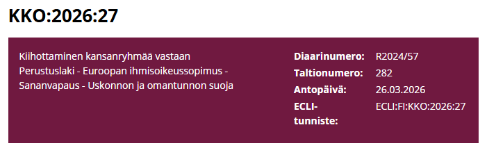

## KKO 2026:27 muistuttaa, että oikeusvaltiossa sananvapaus on laaja, mutta ei rajaton, eikä ihmisarvoa loukkaavaa puhetta voi pestä pelkäksi mielipiteeksi. Juuri siksi on ongelmallista, jos osa nykyhallituksesta seisoo näkyvästi Päivi Räsäsen rinnalla samaan aikaan, kun Korkein oikeus on arvioinut hänen lausumiaan rikosoikeudellisesti. Hallitus ei jaa tuomioita, mutta se rakentaa poliittisen ilmapiirin, jossa syrjivää puhetta normalisoidaan ja oikeusvaltion rajoja koetellaan. Kun vallanpitäjät eivät puolusta yhdenvertaisuutta yhtä äänekkäästi kuin omiaan, kyse ei ole enää vain yksittäisestä tapauksesta vaan siitä, millaista moraalista selkärankaa tämän maan johdolla todella on.

# KKO:2026:27
https://korkeinoikeus.fi/fi/index/ennakkopaatokset/kko202627.html

Kysymys siitä, oliko A syyllistynyt kiihottamiseen kansanryhmää vastaan asettaessaan yleisön saataville ja pitäessään yleisön saatavilla kirjoittamansa kirjoituksen, joka sisälsi homoseksuaaleja solvaaviksi väitettyjä lausumia, ja oliko B syyllistynyt kiihottamiseen kansanryhmää vastaan pitäessään kyseistä kirjoitusta yleisön saatavilla. (Ään.)

Kysymys myös siitä, oliko A syyllistynyt kiihottamiseen kansanryhmää vastaan julkaistessaan Pride-tapahtumaan liittyvän viestin sosiaalisen median tileillään.

RL 11 luku 10 §

## Asian käsittely alemmissa oikeuksissa
### Syyte ja syyttäjien muut vaatimukset sekä vastaukset Helsingin käräjäoikeudessa
Syyttäjät vaativat A:lle rangaistusta syytekohdassa 1 kiihottamisesta kansanryhmää vastaan. Syytteen teonkuvauksen mukaan A oli 1.6.2011–24.1.2022 asettanut yleisön saataville ja pitänyt yleisön saatavilla mielipiteitä ja väitteitä, joissa solvattiin homoseksuaaleja ryhmänä seksuaalisen suuntautumisen perusteella. A oli kansanedustajana toimiessaan X-säätiön pyynnöstä kirjoittanut kirjoituksen ”Mieheksi ja naiseksi hän heidät loi. Homosuhteet haastavat kristillisen ihmiskäsityksen.” (painettu 2004). Kirjoitus oli julkaistu A:n luvalla X-säätiön ja Y-hiippakunnan internetsivustoilla. Kirjoituksessaan A oli esittänyt seuraavat mielipiteet:

”- Mitä varhaisemmassa vaiheessa nuorella on homoseksuaalisia kokemuksia, sitä vaikeampaa tutkimusten mukaan tästä taipumuksesta on myöhemmin päästä eroon.

- Nykyisen arvoköyhän, pinnallisen ja seksikokeiluihin yllyttävän seksuaalivalistuksen yhdistyminen homosuhteiden yleiseen hyväksyttynä esittämiseen on erityisen vaarallinen yhdistelmä. Jos pinnalliseen seksuaaliseen arvopohjaan yhdistetään viesti siitä, että yhteiskunnan kannalta on yhtä toivottavaa avioitua myöhemmin joko omaa tai toista sukupuolta olevan kanssa, tällä rohkaistaan selvästi myös varhaisiin homoseksuaalisiin kokeiluihin. Tämä avaa väylän myös seksuaaliseen hyväksikäyttöön, jossa aikuisten miesten on helpompi saada seksikontakteja alaikäisiin poikiin.

- Perimmiltään kysymys on siitä, onko homoseksuaalisuus neutraali olotila vai negatiivinen kehityshäiriö ihmisen itsensä kannalta. Jos kyseessä on jälkimmäinen vaihtoehto, homoseksuaalien ’oikeuksien’ puolustaminen vahingoittaa näitä ihmisiä edelleen. Tämän lisäksi homoseksuaalien oikeuksien ajaminen edistää yhteiskunnan arvomurrosta, mikä ei ainakaan tue ihmisen kasvua tasapainoiseen aviosuhteeseen.

- Seksuaalisesti poikkeava tunne-elämä on harvoin tahallinen, ihmisen itsensä valitsema tai aiheuttama tila. Sen taustalta voidaan löytää niin varhaislapsuuden kuin murrosiän psykoseksuaaliseen kehitykseen liittyviä häiriöitä.

- Homoseksuaalinen taipumus ei ole sinänsä mielenterveysongelmaan tai fyysiseen sairauteen verrattava ominaisuus. Sen sijaan tieteellinen todistusaineisto osoittaa vastaan sanomattomasti, että homoseksuaalisuus on psykoseksuaalisen kehityksen häiriö. Ne, jotka väittävät homouden olevan luonnollinen, ’terve’ seksuaalisuuden variaatio, mitätöivät perhetaustatutkimuksen todistusarvon poliittisista syistä. Homoaktivistien painostuksen ansiosta poliittiset tavoitteet ovat syrjäyttäneet tieteelliset faktat.

- Seksuaalisen identiteetin eheytyminen kohti normaalia heteroseksuaalista tunne-elämää on mahdollista, jos ihminen on itse motivoitunut ja halukas hoitoon.

- On huomattava, että homokulttuuri on osa seksuaalisen poikkeavuuden kokonaisuutta ja myös itsessään moninainen.

- Homoseksuaalisuuden harjoittamisessa on erotettavissa kaksi päälinjaa: irtosuhteet homoyhteisössä ja pysyvä parisuhde. Irto- ja avosuhteet laillistettiin rikoslain muutoksilla vuonna 1971 ja parisuhteen rekisteröityminen maaliskuussa 2002. Homoyhteisön yleisimpänä mallina vaikuttavat irtosuhteet ja vaihtuvat parisuhteet. Tämän voi väittää olevan seurausta pitkään länsimaisessa kulttuurissa homoihin kohdistuneesta syrjinnästä. Itse näen kuitenkin, että tämä osoittaa jotain myös homoseksuaalisten ihmisten rikkinäisyydestä.

- Eräät piispat ovat raamatuntulkinnassaan vedonneet siihen, että nykyisin homoseksuaalisuuden synnystä tiedetään enemmän kuin Raamatun kirjoittamisen aikoihin. Totta, tiedämme sen olevan psykoseksuaalisen kehityksen häiriö. Alkoholismin taustalta on puolestaan löydetty geneettistä alttiutta, haitallisia ympäristötekijöitä ja käyttäytymismalleja sekä rikollisen taipumuksen taustalta esimerkiksi yhteys tarkkaavaisuushäiriöön. Tulisiko rikollisuus sallia, jos siihen on pakottava taipumus? Jos kerran homoseksuaalisuus on kehityshäiriö, sen harjoittamiseen ei tule kannustaa.”

Syytteen mukaan edellä siteeratuissa tekstiosioissa homoseksuaalisuuden esitettiin olevan epäterve ja epäluonnollinen tila, psykoseksuaalinen kehityshäiriö, josta on päästävä eroon. Homoseksuaalit leimattiin lasten hyväksikäyttöön sekä irtosuhteisiin ja vaihtuviin parisuhteisiin taipuvaisiksi, moraalittomiksi ja rikkinäisiksi ihmisiksi, ja heidän oikeuksiensa puolustaminen asetettiin kyseenalaiseksi. Lausumillaan A väitti, että edellä mainitut ominaisuudet, moraalittomuus ja taipumus tai tarve lasten hyväksikäyttöön, ovat väistämättä homoseksuaalisuuteen liittyviä ominaisuuksia.

Väitteet siitä, että homoseksuaalisuus on psykososiaalisen kehityksen häiriö ja että se on tieteellisesti todistettu sellaiseksi, olivat myös totuutta vastaamattomia.

Syytteen mukaan A väitti, että homoseksuaalisuus seksuaalisena suuntautumisena on itsessään negatiivinen ja tuomittava persoonallinen ominaisuus tai identiteetti, jonka perusteella kaikki homoseksuaalit ovat ja heitä tulee pitää muita ihmisiä alempiarvoisina. Tekstiosiot olivat homoseksuaaleja solvaavia sekä sellaisinaan että osana koko kirjoitusta. A:n lausumat loukkasivat homoseksuaalien yhdenvertaisuutta ja ihmisarvoa ja olivat omiaan aiheuttamaan suvaitsemattomuutta, halveksuntaa ja jopa vihaa homoseksuaaleja kohtaan. Tällaiset homoseksuaaleja halventavat lausumat olivat syrjiviä ja ylittivät siten sanan- ja uskonnonvapauden rajat.

A oli 4.11.2019 levittänyt kirjoitusta edelleen omalla

Facebook-sivullaan. Kirjoitus oli 21.2.2020 julkaistu myös A:n omalla internetsivustolla. A on tunnettu kansanedustaja ja useat tuhannet ihmiset seuraavat hänen sosiaalisen median tilejään.

Syyttäjät vaativat B:lle rangaistusta syytekohdassa 2 kiihottamisesta kansanryhmää vastaan. Syytteen teonkuvauksen mukaan B oli 1.6.2011–24.1.2022 asettanut yleisön saataville ja pitänyt yleisön saatavilla mielipiteen, jossa solvattiin homoseksuaaleja ryhmänä seksuaalisen suuntautumisen perusteella. B oli X-säätiön asiamiehenä ja hallituksen jäsenenä, Y-hiippakunnan hiippakuntadekaanina sekä Z-julkaisusarjasta ja hiippakunnan verkkosivustosta vastaavana julkaissut syytekohdassa 1 kuvatun A:n kirjoittaman kirjoituksen. B oli päättänyt kirjoituksen julkaisemisesta säätiön ja hiippakunnan internetsivustoilla.

Syyttäjät vaativat A:lle rangaistusta syytekohdassa 3 kiihottamisesta kansanryhmää vastaan. Syytteen teonkuvauksen mukaan A oli 17.6.2019–24.1.2022 asettanut yleisön saataville ja pitänyt yleisön saatavilla mielipiteen, jossa solvattiin homoseksuaaleja ryhmänä seksuaalisen suuntautumisen perusteella. A oli kansanedustajana toimiessaan julkaissut omalla Twitter-tilillään, Instagram-tilillään ja Facebook-sivullaan seuraavan tekstin: ”Kirkko on ilmoittanut olevansa Setan Pride 2019 virallinen partneri. Miten kirkon oppiperusta, raamattu, sopii yhteen sen kanssa, että häpeä ja synti nostetaan ylpeyden aiheeksi?” Tekstin yhteyteen A oli liittänyt kuvan Raamatun tekstistä, jossa on Uuden Testamentin Roomalaiskirjeen 1. luvun jakeet 24–27 (Raamatun käännös 1933/-38).

Syytteen mukaan A:n Twitterissä, Facebookissa ja Instagramissa julkaisema mielipide, jonka mukaan homoseksuaalisuus ja homoseksuaalina oleminen on häpeällistä ja synnillistä, solvasi kaikkia homoseksuaaleja ryhmänä. Perusteluina mielipiteilleen A oli esittänyt tviitissään Raamatun yllä mainitut kohdat. Lausuma ilmaisi, että homoseksuaalisuus itsessään on sellainen negatiivinen persoonallinen ominaisuus ja identiteetti, jonka perusteella homoseksuaalit ovat ja heitä tulee pitää moraalittomina ja ihmisinä muita alempiarvoisina. Lausuma oli homoseksuaalien yhdenvertaisuutta ja ihmisarvoa loukkaava ja oli omiaan herättämään halveksuntaa, suvaitsemattomuutta ja jopa vihaa homoseksuaaleja kohtaan. Tällainen mielipide oli syrjintäkiellon vastainen ja ylitti siten sanan- ja uskonnonvapauden rajat.

A oli 17.6.2019 tehtyjen julkaisujen jälkeen 13. ja 23.8.2019 levittänyt edellä kuvattua julkaisua edelleen Twitterissä. A on tunnettu kansanedustaja ja useat tuhannet ihmiset seuraavat hänen sosiaalisen median tilejään.

Syyttäjät vaativat myös, että A ja B velvoitetaan poistamaan yleisön saatavilta ja hävittämään syytekohdissa 1–2 yksilöidyt kirjoituksen osat ja että A velvoitetaan poistamaan yleisön saatavilta ja hävittämään syytekohdassa 3 mainittu verkkoviesti. Lisäksi syyttäjät vaativat, että X-säätiö tuomitaan yhteisösakkoon.

A ja B kiistivät syytteen ja syyttäjien muut vaatimukset, ja X-säätiö kiisti yhteisösakkovaatimuksen.

## Käräjäoikeuden tuomio 30.3.2022 nro 22/113590

Käräjäoikeus totesi, että syytekohdassa 1 tarkoitetussa kirjoituksessa käsiteltiin A:n uskonnollisen vakaumuksen mukaista perhe- ja sukupuolikäsitystä, kirjoitusta edeltävinä vuosina vireillä ollutta rekisteröityä parisuhdetta koskenutta lainsäädäntöhanketta sekä kirjoituksen aikaan esillä olleita avioliitto- ja adoptiolakien muutoshankkeita. Kirjoituksesta ilmeni, että A oli kirjoittanut sen kansanedustajan ja lääkärin ominaisuudessa.

Käräjäoikeus katsoi, että syytekohdan 1 teonkuvauksessa siteeratuista kirjoituksen kohdista ei voitu tehdä sellaista johtopäätöstä, että A leimaisi homoseksuaalit lasten hyväksikäyttöön taipuvaisiksi. A ei myöskään ollut kirjoituksessaan väittänyt, että homoseksuaalisuus seksuaalisena suuntautumisena olisi tuomittava ominaisuus tai identiteetti tai että kaikki homoseksuaalit ovat ja heitä tulee pitää muita ihmisiä alempiarvoisina. A:n kirjoitusta ei voitu tulkita laajentavasti hänen vahingokseen.

Käräjäoikeus katsoi edelleen, että syytteessä siteerattuja kirjoituksen kohtia voitiin edellä lausutusta huolimatta pitää homoseksuaaleja loukkaavina.

A oli kirjoittanut kirjoituksen vuonna 2003 tai 2004, ja se oli tarkoitettu X-säätiön opetusmateriaaliksi. Sitä oli jaettu tutkijoille sekä säätiön piirissä toimivissa seurakunnissa. Kirjoitus oli liittynyt tuolloin ajankohtaiseen ja yleistä mielenkiintoa herättäneeseen aiheeseen. A oli laatinut kirjoituksen kansanedustajana, mutta kirjoitusta ei sen kohdeyleisö huomioon ottaen voitu pitää varsinaisesti poliittisena. Kirjoitus ei ollut herättänyt laajempaa yleistä huomiota ennen kuin vuonna 2019, jolloin siitä oli tehty poliisille tutkintailmoitus ja jolloin esitutkinta oli aloitettu.

Käräjäoikeus katsoi, että A:n kirjoituksen tarkoitus ei ollut homoseksuaalien solvaaminen tai loukkaaminen vaan A:n uskonnollisen vakaumuksen mukaisen miehen ja naisen välisen perhe- ja avioliittokäsityksen puolustaminen.

Ottaen huomioon kirjoituksen taustan ja asiayhteyden, syytteessä siteerattujen kohtien tekstikontekstin, kirjoituksen kokonaisuudessaan sekä siitä ilmenevän kirjoituksen tarkoituksen käräjäoikeus katsoi, ettei syytteessä siteeratuissa A:n kirjoituksessaan esittämissä mielipiteissä ja väitteissä niiden loukkaavuudesta huolimatta ollut kysymys vakavuudeltaan sellaisesta sananvapauden suojan ulkopuolella olevasta vihapuheesta, joka olisi syytteessä väitetyin tavoin loukannut homoseksuaalien yhdenvertaisuutta ja ihmisarvoa ja ollut omiaan herättämään halveksuntaa, suvaitsemattomuutta ja jopa vihaa homoseksuaaleja kohtaan. A ei siten ollut kirjoituksellaan solvannut homoseksuaaleja ryhmänä seksuaalisen suuntautumisen perusteella rikoslain 11 luvun 10 §:ssä tarkoitetulla tavalla. Käräjäoikeus hylkäsi syytteen kohdassa 1.

Käräjäoikeus hylkäsi myös syytekohtaan 1 liittyvän syytteen kohdassa 2 ja X-säätiöön kohdistetun yhteisösakkovaatimuksen.

Käräjäoikeus totesi, että A oli syytekohdassa 3 tarkoitetun tviitin lähettäessään ollut kansanedustaja ja seurakunnan kirkkovaltuutettu. A:n esittämät todisteet tukivat hänen kertomustaan siitä, että tviitti oli kohdistettu kirkon johdolle ja että se oli liittynyt tuolloin käytyyn keskusteluun kirkon osallistumisesta Pride-tapahtumaan. Aihe oli ollut yleisesti kiinnostava, ja viestin suuntaaminen kirkon johdolle osoitti osaltaan, että A:n tarkoitus oli ollut osallistua keskusteluun ja kritisoida kirkkoa.

Käräjäoikeus katsoi, että tviitissä mainittujen häpeän ja synnin liittäminen Pride-tapahtumaan oli ollut tapahtumaan osallistuvia loukkaavaa. A:n tviitille ei kuitenkaan voitu tulkinnalla antaa syytteessä esitettyä merkityssisältöä hänen vahingokseen. Vaikka tviitti oli voinut loukata Pride-tapahtumaan osallistuvia, siinä ei ollut väitetty tapahtumaan osallistuvia esimerkiksi muita alempiarvoisiksi. A:n tarkoituksena tviitin julkaistessaan ei siten voitu katsoa olleen homoseksuaalien halventaminen.

Ottaen huomioon A:n tviitissä käyttämän ilmaisun sekä tviitin tarkoituksen ja liitynnän yhteiskunnalliseen keskusteluun käräjäoikeus katsoi, että keskusteluun osallistuessaan ja kirkkoa kritisoidessaan A:n kansanedustajana ja kirkkovaltuutettuna julkaisema tviitti ei ollut ylittänyt sananvapauden rajoja eikä A siten ollut tviitillään solvannut homoseksuaaleja ryhmänä seksuaalisen suuntautumisen perusteella rikoslain 11 luvun 10 §:ssä tarkoitetulla tavalla. Käräjäoikeus hylkäsi syytteen kohdassa 3.

Asian ovat ratkaisseet laamanni Tuomas Nurmi sekä käräjätuomarit Marja Kekäläinen ja Jussi Leskinen.

## Helsingin hovioikeuden tuomio 14.11.2023 nro 23/144951

Syyttäjät valittivat hovioikeuteen toistaen käräjäoikeudessa esittämänsä vaatimukset.

A, B ja X-säätiö vaativat vastauksissaan, että valitus hylätään.

Hovioikeus totesi, että käräjäoikeuden perustelut koskien A:n lausumien tarkoitusta olivat liittyneet niihin syihin, joiden A oli kertonut olleen lausumien taustalla ja jotka käräjäoikeus oli perustellusti ottanut huomioon tekojen rikosoikeudellisessa arvioinnissa. Kysymys ei näin ollen ollut siitä, että käräjäoikeus olisi edellyttänyt rikostunnusmerkistön täyttymiseksi tarkoitustahallisuutta. Hovioikeus totesi lisäksi, että lausumien antajan tahallisuus ei tullut itsenäisen arvioinnin kohteeksi, kun ilmaisut eivät täyttäneet rikostunnusmerkistöä eivätkä ne siten olleet lainvastaisia. Hovioikeus ei muuttanut käräjäoikeuden tuomion lopputulosta.

Asian ovat ratkaisseet hovioikeuden jäsenet Anna-Maija Ruohoniemi, Arto Perälä ja Maiju Päivärinne.

## Muutoksenhaku Korkeimmassa oikeudessa
Syyttäjille myönnettiin valituslupa.

Syyttäjät vaativat valituksessaan, että A:n syyksi

syytekohdissa 1 ja 3 luetaan kaksi kiihottamista kansanryhmää vastaan ja hänet tuomitaan sakkorangaistukseen, että B:n syyksi syytekohdassa 2 luetaan kiihottaminen kansanryhmää vastaan ja hänet tuomitaan sakkorangaistukseen ja että X-säätiö tuomitaan yhteisösakkoon.

Lisäksi syyttäjät vaativat, että A ja B velvoitetaan poistamaan yleisön saatavilta ja hävittämään syytekohdissa 1–2 yksilöidyt kirjoituksen osat ja että A velvoitetaan poistamaan yleisön saatavilta ja hävittämään syytekohdassa 3 kuvattu verkkoviesti.

A, B ja X-säätiö vaativat vastauksissaan, että valitus hylätään.

## Suullinen käsittely
Korkein oikeus toimitti asiassa suullisen käsittelyn.

## Korkeimman oikeuden ratkaisu
### Perustelut
1. Asian tausta

1. A, joka on koulutukseltaan lääkäri, on kansanedustajana toimiessaan kirjoittanut X-säätiön (jatkossa myös säätiö) pyynnöstä kirjoituksen ”Mieheksi ja naiseksi hän heidät loi. Homosuhteet haastavat kristillisen ihmiskäsityksen.” Kirjoituksen pituus on noin 20 sivua, ja syytekohdan 1 teonkuvauksessa tarkemmin selostetut lausumat sisältyvät kirjoituksen sivuille 9–12 ja 18. A:n kirjoitus on vuonna 2004 julkaistu säätiön Z-julkaisusarjassa painettuna vihkona (painettu 2004).

2. Kirjoitus on sittemmin A:n luvalla julkaistu vuonna 2007 säätiön verkkosivustolla sekä vuonna 2014 säätiön uudistetulla verkkosivustolla ja Y-hiippakunnan verkkosivustolla. Sen jälkeen, kun esitutkinta asiassa oli aloitettu vuonna 2019, A on vuosina 2019 ja 2020 levittänyt kirjoitusta edelleen omilla internet- ja sosiaalisen median sivuillaan.

3. B on puolestaan säätiön asiamiehenä ja hallituksen jäsenenä, Y-hiippakunnan hiippakuntadekaanina sekä Z-julkaisu­sarjasta ja hiippakunnan verkkosivustosta vastaavana päättänyt kirjoituksen julkaisemisesta säätiön ja hiippakunnan verkkosivustoilla.

4. A on 17.6.2019 julkaissut kolmella sosiaalisen median tilillään/sivullaan seuraavan tekstin: ”Kirkko on ilmoittanut olevansa Setan Pride 2019 virallinen partneri. Miten kirkon oppiperusta, raamattu, sopii yhteen sen kanssa, että häpeä ja synti nostetaan ylpeyden aiheeksi?” Tekstin yhteyteen A on liittänyt kuvan Raamatun tekstistä, jossa on Uuden testamentin Roomalaiskirjeen 1. luvun jakeet 24–27 (Raamatun käännös 1933/-38).

5. Syyttäjät ovat katsoneet, että A ja B ovat edellä kohdissa 2 ja 3 kuvatulla menettelyllään asettaneet yleisön saataville ja pitäneet yleisön saatavilla mielipiteitä, joissa solvataan homoseksuaaleja ryhmänä seksuaalisen suuntautumisen perusteella. Syyte ei sen sijaan koske kohdassa 1 tarkoitetun painetun vihkon julkaisemista. Syyttäjät ovat vaatineet A:lle ja B:lle rangaistusta rikoslain 11 luvun 10 §:n nojalla 1.6.2011–24.1.2022 tehdystä kiihottamisesta kansanryhmää vastaan (syytekohdat 1 ja 2). Syyttäjät ovat edelleen katsoneet, että A on edellä kohdassa 4 kuvatulla menettelyllään asettanut yleisön saataville ja pitänyt yleisön saatavilla mielipiteen, jossa solvataan homoseksuaaleja ryhmänä seksuaalisen suuntautumisen perusteella, ja vaatineet hänelle rangaistusta 17.6.2019–24.1.2022 tehdystä kiihottamisesta kansanryhmää vastaan (syytekohta 3). Syyttäjät ovat myös vaatineet, että säätiö tuomitaan vähintään 10 000 euron yhteisösakkoon, koska sen lakisääteiseen toimielimeen tai muuhun johtoon kuuluva ja oikeushenkilössä tosiasiallista päätösvaltaa käyttävä on ollut osallinen rikokseen. Vielä syyttäjät ovat vaatineet, että A ja B velvoitetaan poistamaan yleisön saatavilta ja hävittämään sisällöltään lainvastaiset verkkoviestit.

6. Käräjäoikeus on hylännyt syytteen sekä syyttäjien muut vaatimukset. Hovioikeus ei ole muuttanut käräjäoikeuden tuomion lopputulosta.

2. Kysymyksenasettelu Korkeimmassa oikeudessa

7. Korkeimmassa oikeudessa on kysymys siitä, täyttääkö syytekohdissa 1 ja 3 kuvattu A:n menettely ja syytekohdassa 2 kuvattu B:n menettely kiihottamista kansanryhmää vastaan koskevan tunnusmerkistön. Jos heidän katsotaan syyllistyneen menettelyllään rikokseen, asiassa on kysymys myös rangaistusten määräämisestä, yhteisösakon tuomitsemisen edellytyksistä sekä verkkoviestien poistamis- ja hävittämismääräyksen antamisen edellytyksistä.

3. Sovellettava rangaistussäännös ja arvioinnin lähtökohdat

8. Rikoslain 11 luvun 10 §:n mukaan kiihottamisesta kansanryhmää vastaan tuomitaan se, joka asettaa yleisön saataville tai muutoin yleisön keskuuteen levittää tai pitää yleisön saatavilla tiedon, mielipiteen tai muun viestin, jossa uhataan, panetellaan tai solvataan jotakin ryhmää rodun, ihonvärin, syntyperän, kansallisen tai etnisen alkuperän, uskonnon tai vakaumuksen, seksuaalisen suuntautumisen tai vammaisuuden perusteella taikka niihin rinnastettavalla muulla perusteella.

9. Syytteen tekoaika syytekohdissa 1 ja 2 alkaa 1.6.2011, jolloin voimaan tulleella lainmuutoksella (511/2011) kiihottamista kansanryhmää vastaan koskeva tunnusmerkistö on saanut nykyisen sisältönsä. Pykälään tuolloin tehdyt muutokset koskivat rikoksen tekotapaa ja suojelun kohteena olevan ryhmän määrittelyn perustetta. Lainmuutokseen johtaneen hallituksen esityksen perustelujen mukaan muutokset olivat luonteeltaan pykälää täsmentäviä, mutta ne saattoivat merkitä joiltakin osin myös pykälän soveltamisalan vähäistä laajennusta (HE 317/2010 vp s. 39).

10. Perustelujen mukaan muutoksilla on haluttu varmistaa pykälän sovellettavuutta, ei pelkästään rasistista motiivia edellyttävänä, vaan laajemmin ns. viharikoksia koskevana säännöksenä. Aikaisemmin voimassa olleen säännöksen kaikkia perusteita koskeva rinnastuslauseke osoitti, että kiihottamisrikos soveltuu varsinaisten rasististen perusteiden ohella myös eräisiin muihin perusteisiin, jotka voidaan lukea laajemmin viharikosperusteisiin, kuten esimerkiksi ainakin osaan seksuaalista suuntautumista. Koska rikosoikeudellinen laillisuusperiaate asettaa rajoja sille, miten pitkälle tunnusmerkistö voidaan tulkinnallisesti ulottaa, lakia täsmennettiin niin, että ainakin tyypillisimmät vähemmistöryhmät, jotka käytännössä tarvitsevat säännöksen suojaa, mainittiin nimenomaisesti suojelun kohteena. Pykälään lisättiin siten nimenomainen maininta seksuaalisesta suuntautumisesta, mikä korostaa aikaisempaa selvemmin sitä, että rangaistussäännös antaa laajalti suojaa viharikoksia vastaan. (HE 317/2010 vp s. 39 ja 41.)

11. Säännöksen sisältöä täsmennettiin myös mainitsemalla tekotapoina ryhmää solvaavan kirjoituksen asettaminen yleisön saataville ja pitäminen yleisön saatavilla. Tämän muutoksen taustalla on perustelujen mukaan ollut sen varmistaminen, että säännös soveltuu internetissä tehtäviin rikoksiin. (HE 317/2010 vp s. 39–40.)

12. Kiihottamista kansanryhmää vastaan koskevalla rangaistussäännöksellä suojataan Suomen perustuslain 1 §:n 2 momentissa tarkoitettua ihmisarvon loukkaamattomuutta sekä perustuslain 6 §:ssä tarkoitettua ihmisten yhdenvertaisuutta ja syrjimättömyyttä. Säännöksen perusteluissa (HE 317/2010 vp s. 42) kuvataan tyypillisen rangaistavan menettelyn olevan sellainen, jossa levitetään tieto, mielipide tai muu viesti, jossa ryhmään kohdistuvaa väkivaltaa tai syrjintää pidetään hyväksyttävänä tai toivottavana tai ihmisiä verrataan eläimiin, loisiin ja niin edelleen tai yleistäen väitetään heitä rikollisiksi tai esitetään alempiarvoisiksi ja niin edelleen.

13. Korkein oikeus toteaa rikoslain 11 luvun 10 §:n sanamuodon edellyttävän, että viestin on oltava säännöksessä tarkoitettuja ryhmiä uhkaava, panetteleva tai solvaava, jotta viestin levittämistä voidaan pitää rangaistavana. Esitöistä ja säännöksen tarkoituksesta voidaan päätellä, että lausumaa voidaan pitää solvaavana, jos siinä kiistetään ryhmään kuuluvien ihmisten ihmisarvo tai vähätellään sitä taikka muuten ilmaistaan hyväksyntää sille, että ryhmään kuuluviin ihmisiin kohdistetaan suvaitsemattomuutta tai syrjintää.

14. Hallituksen esityksen perusteluissa on todettu, että kiihottamista kansanryhmää vastaan koskevan rangaistussäännöksen soveltamisessa ja rangaistavuuden rajaamisessa on tärkeää ottaa huomioon säännöksen suhde perustuslain ja Euroopan ihmisoikeussopimuksen suojaamaan sananvapauteen. Perusteluissa on tältä osin viitattu sananvapauden käyttämisestä joukkoviestinnässä annetun lain 1 §:n 2 momentin säännökseen, jonka mukaan viestintään ei saa puuttua enempää kuin on välttämätöntä ottaen huomioon sananvapauden merkitys kansanvaltaisessa oikeusvaltiossa. (HE 317/2010 vp s. 42.)

15. Korkein oikeus toteaa, että tunnusmerkistön täyttymistä arvioitaessa on otettava huomioon paitsi hallituksen esityksessä todetuin tavoin sananvapaus myös muut mahdollisesti relevantit perusoikeudet. Nyt arvioitavana olevassa tapauksessa relevanttia on sananvapauden lisäksi uskonnonvapauden suoja, kun otetaan huomioon syytekohdissa 1 ja 2 tarkoitetun kirjoituksen sisältö kokonaisuudessaan sekä syytekohdassa 3 tarkoitettuun viestiin jäljennetty Raamatun teksti ja viestin liittyminen kirkon toimintaan. Kyse on tapauskohtaisesta punninnasta, jossa säännöksellä suojattavaan ryhmään kuuluvien ihmisten ihmisarvon loukkaamattomuutta ja yhdenvertaisuutta on suhteutettava ryhmää koskevan viestin esittäjän sanan- ja uskonnonvapauteen. Tässä punninnassa on otettava huomioon, kuinka loukkaavista ja vakavista lausumista on kysymys ja kuinka välttämättömänä sanan- ja uskonnonvapauteen puuttumista on tästä syystä pidettävä.

4. Sananvapaus ja sitä koskevaa oikeuskäytäntöä

16. Perustuslain 12 §:n 1 momentin mukaan jokaisella on sananvapaus, johon sisältyy oikeus ilmaista, julkistaa ja vastaanottaa tietoja, mielipiteitä ja muita viestejä kenenkään ennakolta estämättä. Sananvapaus turvataan myös eräissä Suomea sitovissa ihmisoikeussopimuksissa, kuten Euroopan ihmisoikeussopimuksen 10 artiklassa. Sananvapauden suoja ei kuitenkaan ole rajoittamaton. Ihmisoikeussopimuksen 10 artiklan 2 kappaleen mukaan sananvapautta voidaan rajoittaa silloin, kun rajoituksista on säädetty laissa ja rajoitukset ovat välttämättömiä demokraattisessa yhteiskunnassa muun muassa muiden henkilöiden maineen tai oikeuksien suojaamiseksi.

17. Korkein oikeus on ratkaisukäytännössään todennut, että sananvapauden suojan keskeisenä ajatuksena on oikeus ilmaista, julkistaa ja vastaanottaa tietoja, mielipiteitä ja muita viestejä kenenkään ennalta estämättä. Sananvapautta voi käyttää kaikenlaisissa julkaisemisen välineissä, ja se koskee myös loukkaavien, liioittelevien ja häiritsevien mielipiteiden esittämistä. Ilmaisuja on tarkasteltava huomioon ottaen se asiayhteys, missä ilmaisu on esitetty. (Ks. esim. KKO 2022:63, kohta 6 ja siinä viitatut ratkaisut.)

18. Euroopan ihmisoikeustuomioistuimen ratkaisukäytännön perusteella voidaan puolestaan päätellä, että rikosoikeudellinen seuraamus on voitu tuomita sananvapauden suojasta huolimatta lähinnä silloin, kun perus- ja ihmisoikeuksia voidaan katsoa loukatun vihaan tai väkivaltaan yllyttämisen muodossa. Sellaisten vihapuheiden, jotka saattavat loukata henkilöitä tai henkilöryhmiä, ei ole katsottu ansaitsevan sananvapauden suojaa. (Ks. esim. KKO 2022:63, kohta 7 ja siinä viitatut ratkaisut.) Ihmisoikeustuomioistuimen ratkaisukäytäntö osoittaa myös, että vihaan yllyttäminen ei välttämättä tarkoita nimenomaista väkivaltaan tai muuhun rikolliseen tekoon kehottamista. Sananvapauden rajoittamiseen voi olla riittävät perusteet silloin, kun rasistista, muukalaisvihamielistä tai muutoin syrjivää puhetta käytetään tietyn ryhmän loukkaamiseen, pilkkaamiseen tai solvaamiseen. (Féret v. Belgia, 16.7.2009, kohta 73, Vejdeland ym. v. Ruotsi, 9.2.2012, kohta 55 ja Atamanchuk v. Venäjä, 11.2.2020, kohta 52).

19. Ihmisoikeustuomioistuin on useissa ratkaisuissaan ar­vioinut sitä, milloin välittömässä tai laajemmassa yhteydessään riittävän täsmällisesti ilmaistut lausumat voidaan nähdä suorana tai epäsuorana kehotuksena väkivaltaan taikka väkivallan, vihan tai suvaitsemattomuuden oikeutuksena. Tällaiset lausumat eivät välttämättä nauti sananvapauden suojaa. Ihmisoikeustuomioistuin on omaksunut ankaran suhtautumisen sellaisiin yleistäviin lausumiin, joissa hyökätään kokonaista etnistä, uskonnollista tai muuta ryhmää, kuten esimerkiksi homoseksuaaleja vastaan, tai asetetaan tällainen ryhmä kielteiseen valoon. (Ks. esim. Perinçek v. Sveitsi, suuri jaosto, 15.10.2015, kohta 206 ja siinä mainitut ratkaisut.) Pelkästään se, että jotkut henkilöt tai ryhmät kokevat lausuman loukkaavaksi tai häpäiseväksi, ei kuitenkaan tee puheesta vihapuhetta (Ibragim Ibragimov ja muut v. Venäjä, 28.8.2018, kohta 115 sekä Yefimov ja Youth Human Rights Group v. Venäjä, 7.12.2021, kohta 44). Ihmisoikeustuomioistuin on edelleen korostanut, että seksuaaliseen suuntautumiseen perustuva syrjintä on yhtä vakavaa kuin rotuun, alkuperään tai ihonväriin perustuva syrjintä (Vejdeland ym. v. Ruotsi, kohta 55).

20. Ihmisoikeustuomioistuin on korostanut sananvapauden merkitystä niin poliittisista aiheista kuin muista yleistä mielenkiintoa herättävistä asioista keskusteltaessa. Tuomioistuin on pitänyt sananvapauden suojaa erityisen tärkeänä, kun kyse on kansan vaaleilla valituista edustajista taikka poliittisista puolueista tai niiden aktiivisista jäsenistä. Ihmisoikeustuomioistuin on kuitenkin muistuttanut, että edes poliittisen puheen alueella sananvapaus ei ole luonteeltaan ehdoton, vaan sopimusvaltiot voivat asettaa sen tiettyjen rajoitusten tai seuraamusten kohteeksi. Koska suvaitsevaisuus ja kaikkien ihmisten yhtäläisen ihmisarvon kunnioittaminen ovat demokraattisen ja moniarvoisen yhteiskunnan perusta, sananvapauden rajoittamiseen voi olla riittävät perusteet, kun tavoitteena on estää kaikki sellaiset ilmaisun muodot, jotka levittävät, rohkaisevat, edistävät tai oikeuttavat suvaitsemattomuuteen (mukaan lukien uskonnollinen suvaitsemattomuus) perustuvaa vihaa. Ihmisoikeustuomioistuin on painottanut, että poliittisilla toimijoilla on myös velvollisuuksia ja vastuita ja että poliitikkojen on esiintyessään julkisuudessa ratkaisevan tärkeää välttää lausumia, jotka saattaisivat edistää suvaitsemattomuutta. (Sanchez v. Ranska, suuri jaosto, 15.5.2023, kohdat 146–150 ja siinä viitatut ratkaisut.)

21. Korkein oikeus toteaa, että ihmisoikeustuomioistuimen arviointi sananvapautta koskevissa ratkaisuissa on eri seikkojen välistä punnintaa ja keskinäistä suhdetta sekä kontekstisidonnaisuutta korostavaa (Perinçek v. Sveitsi, kohta 208). Arvioinnissa on otettu huomioon erityisesti seuraavia seikkoja: lausumien konteksti, niiden luonne ja sanamuoto, kansallisten tuomioistuinten esittämät perustelut lausumiin puuttumisen oikeuttamiseksi, onko lausumat esitetty kireässä poliittisessa tai sosiaalisessa tilanteessa, voidaanko lausumia puolueettomasti arvioituina ja välittömästi tai laajemmassa yhteydessä ymmärrettyinä pitää suorana tai epäsuorana kehotuksena väkivaltaan tai väkivallan, vihan tai suvaitsemattomuuden oikeuttamisperusteena, lausumien esittämistapa sekä lausumien välittömät tai välilliset mahdollisuudet johtaa haitallisiin seurauksiin. Yksittäistapauksellisen arvioinnin lopputulos riippuu pikemminkin eri seikkojen keskinäisestä vuorovaikutuksesta kuin mistään niistä erikseen tarkasteltuna. (Atamanchuk v. Venäjä, kohta 50 ja siinä viitatut ratkaisut.)

5. Uskonnonvapaus ja sitä koskevaa oikeuskäytäntöä

22. Perustuslain 11 §:n mukaan jokaisella on uskonnon ja omantunnon vapaus, johon sisältyy muun ohella oikeus tunnustaa ja harjoittaa uskontoa sekä oikeus ilmaista vakaumus. Uskonnonvapaus turvataan myös eräissä Suomea sitovissa ihmisoikeussopimuksissa, kuten Euroopan ihmisoikeussopimuksen 9 artiklassa. Myöskään uskonnonvapauden suoja ei ole rajoittamaton. Ihmisoikeussopimuksen 9 artiklan 2 kappaleen mukaan henkilön vapautta tunnustaa uskontoaan tai uskoaan voidaan rajoittaa silloin, kun rajoituksista on säädetty laissa ja rajoitukset ovat välttämättömiä demokraattisessa yhteiskunnassa muun muassa muiden henkilöiden oikeuksien ja vapauksien turvaamiseksi.

23. Perustuslain 11 §:ään ei sisälly erillistä rajoituslauseketta. Kuten perusoikeusuudistusta koskevassa hallituksen esityksessä (HE 309/1993 vp s. 56) on korostettu, rajoituslausekkeen puuttuminen ei merkitse sitä, että uskonnonvapauteen vedoten voitaisiin harjoittaa toimia, jotka loukkaavat ihmisarvoa tai muita perusoikeuksia tai ovat oikeusjärjestyksen perusteiden vastaisia. Sekä ihmisoikeustuomioistuimen että Korkeimman oikeuden ratkaisukäytännössä on katsottu, että uskonnonvapaus ei suojaa kaikkea sellaista toimintaa, jonka taustalla on henkilön uskonto tai usko (esim. Leyla Şahin v. Turkki, suuri jaosto, 10.11.2005, kohta 105 ja KKO 2010:74, kohta 25).

24. Ihmisoikeustuomioistuin on todennut uskonnonvapauden käsittävän niin yhteisöllisesti ja julkisesti kuin yksityisesti tapahtuvan uskonnon harjoittamisen, samoin kuin oikeuden oman vakaumuksen levittämiseen muille ihmisille (Kokkinakis v. Kreikka, 25.5.1993, kohta 31). Uskonnollisen vakaumuksen ilmaisemisen arvioinnissa ei voida ottaa huomioon, onko henkilön uskonkäsitys oikeutettu vai ei (Manoussakis ym. v. Kreikka, 26.9.1996, kohta 47). Ihmisoikeustuomioistuin on todennut myös, että uskonnollisten mielipiteiden yhteydessä sananvapauden käyttämiseen liittyviin vastuisiin voidaan oikeutetusti sisällyttää velvollisuus välttää mahdollisimman pitkälle ilmaisuja, jotka loukkaavat tarpeettomasti muita ja siten loukkaavat heidän oikeuksiaan ja jotka eivät näin ollen edistä rakentavaa julkista keskustelua (Gündüz v. Turkki, 4.12.2003, kohta 37).

25. Korkein oikeus toteaa, että uskonnonvapaus suojaa yhtäläisesti kaikkien uskontojen harjoittajia. Esimerkiksi homoseksuaaleja ryhmänä koskevien lausumien rangaistavuutta suhteessa uskonnonvapauteen on siten arvioitava samalla tavalla riippumatta siitä, minkä uskonnon pyhillä kirjoituksilla tai muilla opetuksilla lausumien esittäjä on käsityksiään perustellut.

6. Syytekohdat 1 ja 2

6.1 Tekojen ajallinen ulottuvuus

6.1.1 Arvioinnin lähtökohdat

26. Syyttäjät ovat katsoneet rangaistavan menettelyn alkaneen syytekohdissa 1 ja 2 siitä, kun rikoslain 11 luvun 10 §:n kiihottamista kansanryhmää vastaan koskevan rangaistussäännöksen muutos on tullut voimaan 1.6.2011. Tuolloin on säädetty kiihottamisrikoksen uusiksi tekotavoiksi tunnusmerkistössä kuvatun aineiston asettaminen yleisön saataville ja pitäminen yleisön saatavilla.

27. Lainmuutokseen johtaneessa hallituksen esityksessä (HE 317/2010 vp s. 39) yleisön saataville asettamista on luonnehdittu siten, että se kattaa paitsi aineiston saattamisen esimerkiksi internetin keskustelupalstalle tai muulle sivustolle myös linkkien perustamisen ja kokoamisen, jotta kyseinen aineisto olisi helpommin toisten saatavilla. Tekijävastuuseen voivat siten joutua tekstin kirjoittajan ja hänen kirjoituksensa yleisön saataville asettaneen lisäksi myös joku muu henkilö.

28. Yleisön saatavilla pitämisen lisäämistä tekotavaksi on puolestaan hallituksen esityksessä (s. 40) perusteltu sillä, että aikaisemman säännöksen soveltamisessa oli ollut epäselvyyttä siitä, olisiko levittämisenä pidettävä myös aineiston pitämistä yleisön saatavilla. Muutoksen on katsottu ilmentävän kiihottamisrikoksen luonnetta jatkuvaluonteisena rikoksena, millä on merkitystä osallisuuden ja rikoksen vanhentumisen kannalta.

29. Korkein oikeus toteaa niin rangaistussäännöksen sanamuodon kuin esitöiden osoittavan, että tekijävastuun syntyminen edellyttää sellaista tekoa tai laiminlyöntiä, jolla tekijä mahdollistaa sen, että yleisöllä on pääsy tunnusmerkistössä kuvattuun aineistoon. Tällainen tekijävastuulle asetettava vaatimus käy selkeästi ilmi yleisön saataville asettamista koskevasta tekotapatunnusmerkistä, mutta sen voidaan katsoa sisältyvän välillisesti myös yleisön saatavilla pitämistä koskevaan tekotapatunnusmerkkiin.

30. Korkein oikeus toteaa edelleen, että rangaistussäännökseen 1.6.2011 voimaan tulleella lailla lisätyt tekotavat voivat täyttyä eri henkilöiden kohdalla saman aineiston osalta siten, että yksi asettaa tunnusmerkistössä kuvatun aineiston yleisön saataville ja sen jälkeen toinen pitää kyseistä aineistoa yleisön saatavilla. Koska aineiston pitämistä yleisön saatavilla koskevassa tekotavassa on kyse jatkuvasta rikoksesta, tekotapatunnusmerkin täyttyminen ei kuitenkaan välttämättä edellytä sitä, että joko saman tai jonkun toisen henkilön katsottaisiin asettaneen aineiston yleisön saataville välittömästi ennen yleisön saatavilla pitämistä koskevaa menettelyä.

6.1.2 Tekoaikaa koskeva arviointi syytekohdassa 1

31. Syyttäjät ovat katsoneet A:n syyllistyneen kiihottamiseen kansanryhmää vastaan 1.6.2011–24.1.2022. Syyte rakentuu sille ajatukselle, että A olisi rangaistussäännökseen tehdyn muutoksen voimaantulosta 1.6.2011 alkaen pitänyt säännöksessä tarkoitetulla tavalla yleisön saatavilla kirjoitustaan, joka oli hänen luvallaan julkaistu vuonna 2007 säätiön verkkosivustolla ja myöhemmin myös Y-hiippakunnan verkkosivustolla.

32. Korkein oikeus toteaa, että A:lla ei ole väitettykään olleen säätiössä tai Y-hiippakunnassa sellaista asemaa, jonka perusteella hän olisi ollut syytteen mukaisena tekoaikana vastuussa siitä, millaista aineistoa niiden verkkosivustoilla pidetään saatavilla. Pelkästään se, että A oli vuosia aikaisemmin antanut luvan kirjoituksensa julkaisemiseen säätiön verkkosivustolla, ei perusta hänelle tällaista vastuuasemaa.

33. Asiassa ei ole myöskään esitetty selvitystä siitä, että A olisi ollut vuoden 2007 jälkeen millään tavalla tekemisissä kyseisen kirjoituksen kanssa ennen 4.11.2019, jolloin hän on syytteessä kerrotuin tavoin itse jakanut kirjoituksen uudelleen. Korkeimman oikeuden suullisessa käsittelyssä on päinvastoin tullut ilmi, että kirjoituksen julkaiseminen vuonna 2014 säätiön uudistetulla verkkosivustolla ja Y-hiippakunnan verkkosivustolla on ollut laajaan aineistosiirtoon liittyvä lähinnä tekninen toimenpide. B:n kertoman mukaan A:lta ei ole silloin pyydetty suostumusta aineiston siirtoon.

34. Edellä todetut seikat huomioon ottaen Korkein oikeus katsoo, että A:n ei voida katsoa rangaistussäännöksessä tarkoitetulla tavalla asettaneen kirjoitusta yleisön saataville tai pitäneen sitä yleisön saatavilla 1.6.2011 alkaen ennen 4.11.2019 tapahtunutta kirjoituksen uudelleen julkistamista. Tämän vuoksi A:han syytekohdassa 1 kohdistettu syyte on ajanjakson 1.6.2011–3.11.2019 osalta hylättävä.

35. A on sittemmin 4.11.2019 jakanut kirjoituksen omalla Facebook-sivullaan ja julkaissut sen 21.2.2020 omalla internetsivustollaan. A on kertonut menettelynsä syyksi sen, että hän on katsonut tarpeelliseksi jakaa tekstin ihmisten arvioitavaksi tilanteessa, jossa valtakunnansyyttäjä oli 4.11.2019 tiedottanut määränneensä asiassa toimitettavaksi esitutkinnan.

36. Korkein oikeus katsoo, että A:n menettelyssä on 4.11.2019 ja 21.2.2020 ollut kyse kirjoituksen asettamisesta yleisön saataville ja näistä ajankohdista lähtien syytteen tekoajan loppuun eli 24.1.2022 saakka kirjoituksen pitämisestä yleisön saatavilla. Tekotapatunnusmerkin täyttymiseen ei vaikuta A:n ilmoittama syy toiminnalleen. Näin ollen A:n osalta tekoaikana on pidettävä 4.11.2019–24.1.2022, jos rikoksen tunnusmerkistön katsotaan täyttyvän myös kirjoituksen sisällön osalta ja hänen menettelyään pidetään tahallisena.

6.1.3 Tekoaikaa koskeva arviointi syytekohdassa 2

37. Syyttäjät ovat katsoneet B:n syyllistyneen kiihottamiseen kansanryhmää vastaan 1.6.2011–24.1.2022. B:n vastuu perustuu syyttäjien mukaan siihen, että hän on ollut rangaistussäännökseen tehdyn muutoksen voimaantulosta 1.6.2011 alkaen asemansa perusteella vastuussa säätiön ja sittemmin myös Y-hiippakunnan verkkosivustoille yleisön saataville asetetun ja sivustoilla yleisön saatavilla pidetyn aineiston sisällöstä.

38. Korkein oikeus katsoo, että B:n osalta aineiston pitämistä yleisön saatavilla koskeva tekotapatunnusmerkki on täyttynyt 1.6.2011 alkaen, koska hän on tänä aikana säätiön asiamiehenä ja hallituksen jäsenenä sekä Z-julkaisusarjasta vastaavana vastannut säätiön verkkosivustosta, jolla A:n kirjoitus on jatkuvasti ollut yleisön saatavilla. Vuodesta 2014 lähtien, jolloin kirjoitus on julkaistu myös Y-hiippakunnan verkkosivustolla, hän on riidattomasti vastannut myös hiippakunnan verkkosivustosta. Näin ollen syytekohdan 2 mukainen tekoaika on rangaistussäännökseen sisältyvien objektiivisten tekotapatunnusmerkkien kannalta tarkasteltuna alkanut 1.6.2011 ja päättynyt 24.1.2022. Jäljempänä kohdissa 66–68 arvioidaan tekoaikaa erikseen tahallisuusvaatimuksen kannalta.

6.2 Kirjoitukseen sisältyvien lausumien rangaistavuus

6.2.1 Arvioinnin lähtökohdat

39. Niin kuin edellä selostetusta ihmisoikeustuomioistuimen ratkaisukäytännöstä ilmenee, sananvapauden rajoittamisen asianmukaisuutta arvioitaessa on otettava huomioon se asiayhteys, jossa kiihottamisrikoksena rangaistavaksi väitetyt lausumat on esitetty. Lausumia on toisin sanoen tarkasteltava ottaen huomioon muun ohella niiden julkaisutapa ja kohdeyleisö sekä se, onko kyse poliittisesta tai yleistä mielenkiintoa herättävästä yhteiskunnallisesta keskustelusta. Lisäksi on otettava huomioon lausumien sisältö, esittämistapa ja niistä aiheutuvien haitallisten seurausten riski. Sananvapauden ohella tässä asiassa on kysymys uskonnonvapaudesta, ja myös sen rajoittamisen välttämättömyyttä arvioitaessa on otettava huomioon samat perusteet. Sanan- ja uskonnonvapauden rajoittamisen arvioinnissa korostuvat siten eri seikkojen välinen punninta ja keskinäinen suhde sekä kontekstisidonnaisuus. Ihmisoikeustuomioistuimen ratkaisukäytännön mukaisesti keskeistä on se, voidaanko arvioitavia lausumia pitää suorana tai epäsuorana kehotuksena väkivaltaan tai väkivallan, vihan tai suvaitsemattomuuden oikeuttamisperusteena.

6.2.2 Kirjoituksen asiayhteys ja sisältö

40. Kirjoitus on alun perin julkaistu vuonna 2004 painettuna vihkona, joka oli tarkoitettu uskonnollisen säätiön opetusmateriaaliksi. Sitä oli jaettu tutkijoille sekä säätiön piirissä toimivissa seurakunnissa. Kirjoitus on edellä selostetuin tavoin sittemmin julkaistu säätiön ja hiippakunnan verkkosivustoilla. A on 4.11.2019 levittänyt kirjoitusta omalla Facebook-sivullaan, ja se on julkaistu 21.2.2020 myös A:n omalla internetsivustolla.

41. Kirjoituksen kirjoittajatiedoissa on mainittu A:n olevan lääkäri ja kansanedustaja. Kirjoituksen lopussa kustantajan puolesta kirjoitusta on luonnehdittu avioliittomoraalin rappiota sekä seksuaalisten poikkeavuuksien nousua ja levittäytymistä koskevaksi informaatiokirjaseksi. A:n roolia kirjoittajana on luonnehdittu siten, että hän kansanedustajana selvittää asiaan liittyvää yhteiskunnan säännöstöä, lääkärinä valottaa ilmiötä ihmisen psyyken häiriönä ja perheen aseman hämärtäjänä sekä kristittynä kokoaa asiassa Raamatun yksiselitteiset opetukset, Jumalan tahdon.

42. Kirjoitus jakaantuu johdantoon, kahteen päälukuun ja loppusanoihin. Luvun 1 otsikko on ”Vaikutukset yhteiskunnassa” (s. 5–14), ja siinä A on käsitellyt näkemyksiään avioliitosta, perheestä ja homoseksuaalisuudesta. Hän on tarkastellut muun ohella kirjoitusta edeltävinä vuosina vireillä ollutta rekisteröityä parisuhdetta koskenutta lainsäädäntöhanketta sekä kirjoituksen laatimishetkellä keskustelun kohteena ollutta kysymystä samaa sukupuolta olevien parien oikeudesta adoptioon. Luvun 2 otsikko on ”Raamattu ja kirkko” (s. 15–22), ja siinä A on käsitellyt ennen kaikkea sitä, miten Raamatussa suhtaudutaan homoseksuaalisuuteen.

43. Syytekohtien 1 ja 2 teonkuvauksissa mainitut lausumat sisältyvät yhtä lukuun ottamatta kirjoituksen lukuun 1. Kirjoituksessa esitettyjä mielipiteitä on perusteltu olennaisesti viittaamalla lääketieteellisiin tutkimuksiin homoseksuaalisuuden syistä sekä erilaisten perhemuotojen yhteiskunnalliseen merkitykseen. Joltain osin mielipiteitä on perusteltu myös A:n uskonnollisiin käsityksiin pohjautuvilla argumenteilla.

44. Kirjoitus on liittynyt tuolloin ajankohtaiseen yhteiskunnalliseen keskusteluun, sillä laki rekisteröidystä parisuhteesta oli tullut voimaan vuonna 2002 eli kaksi vuotta ennen kirjoituksen alkuperäistä julkaisuajankohtaa. Kirjoituksen voi katsoa liittyneen ajankohtaiseen yhteiskunnalliseen keskusteluun myös myöhemmin, sillä perheen sisäinen adoptio samaa sukupuolta oleville pareille on tullut mahdolliseksi vuonna 2009 ja avioliitto samaa sukupuolta olevien kesken vuonna 2017.

45. A on kirjoituksessaan muun ohella todennut, että seksuaalisesti poikkeavan tunne-elämän taustalla on psykoseksuaaliseen kehitykseen liittyviä häiriöitä ja että tieteellinen todistusaineisto osoittaa vastaansanomattomasti homoseksuaalisuuden olevan psykoseksuaalisen kehityksen häiriö. Hän on kiistänyt väitteen siitä, että homous olisi luonnollinen ja terve seksuaalisuuden variaatio. Edelleen hän on todennut tietyin edellytyksin olevan mahdollista, että seksuaalinen identiteetti eheytyy kohti normaalia heteroseksuaalista tunne-elämää, ja todennut homokulttuurin olevan osa seksuaalisen poikkeavuuden kokonaisuutta.

46. Korkein oikeus toteaa, että asiassa esitetystä Terveyden ja hyvinvoinnin laitoksen 15.4.2020 antamasta asiantuntijalausunnosta ilmenee, että nykylääketieteen (psykiatrian) mukaan homoseksuaalisuutta pidetään osana normaalia seksuaalisuuden kirjoa. Sitä ei pidetä fyysisenä tai psyykkisenä sairautena tai niihin verrattavana häiriönä, eikä ole lääketieteellisiä perusteita luonnehtia homoseksuaalisuutta psykoseksuaaliseksi kehityshäiriöksi, psyykeen häiriöksi, kehityshäiriöksi tai kehityspoikkeamaksi suhteessa heteroseksuaalisuuteen taikka psykopatologiseksi häiriöksi tai perversioksi. Homoseksuaalisuuden väittäminen psykoseksuaalisen kehityksen häiriöksi on siten vallitsevan lääketieteellisen käsityksen valossa virheellinen väite, jota voidaan pitää homoseksuaaleja solvaavana.

47. Korkein oikeus toteaa edelleen, että kirjoituksessa homoseksuaaleja ei pidetä samanarvoisina heteroseksuaalien kanssa, koska kirjoituksessa homoseksuaalisuutta ei pidetä luonnollisena seksuaalisuuden variaationa ja sen väitetään olevan seksuaalisesti poikkeavaa, kun taas heteroseksuaalisuus esitetään normaalin mittapuuna, jota kohti homoseksuaali mahdollisesti voi eheytyä. Merkille pantavaa on myös, että kirjoituksessa asiaa ei käsitellä yksittäisten homoseksuaalien mahdollisesti kokemien ongelmien näkökulmasta, vaan psykoseksuaalisen kehityksen häiriönä, joka kirjoituksessa liitetään homoseksuaalisuuteen sinänsä eli kaikkiin homoseksuaaleihin ryhmänä.

48. Edellä kuvatut kirjoituksen kohdat eivät kirjoitusta kokonaisuutena tarkasteltaessa näyttäydy asiayhteydestä irrotettuina lausumina, vaan kirjoituksen sisällä johdonmukaisina, toistuvina ja vakavasti otettavina lausumina. Korkein oikeus katsoo, että näiltä osin A:n lausumilla on solvattu homoseksuaaleja ryhmänä seksuaalisen suuntautumisen perusteella.

49. Sen sijaan muut syytteessä siteeratut kirjoituksen kohdat eivät ole vakavuudeltaan tällaisia, homoseksuaaleja ryhmänä seksuaalisen suuntautumisen perusteella solvaavia. Esimerkiksi väite irtosuhteista ja vaihtuvista parisuhteista homoyhteisön yleisimpänä parisuhdemallina on yleistävä mutta ei kuitenkaan solvaava väite. Lisäksi Korkein oikeus katsoo alempien tuomioistuinten tavoin, että A ei ole kirjoituksessaan väittänyt, että homoseksuaalisuudesta olisi päästävä eroon. Kirjoituksen ei voida myöskään katsoa sisältävän sellaista selkeää väitettä, jonka mukaan A leimaisi homoseksuaalit lasten hyväksikäyttöön taipuvaisiksi, moraalittomiksi ja rikkinäisiksi ihmisiksi tai asettaisi heidän oikeuksiensa puolustamisen kyseenalaiseksi. Hän ei ole myöskään kirjoituksessaan väittänyt, että homoseksuaalisuus seksuaalisena suuntautumisena olisi yksiselitteisesti tuomittava ominaisuus tai identiteetti.

6.2.3 Lausumien rangaistavuuden arviointi syytekohdassa 1

50. Kohdassa 45 kuvatuilta osin A:n kirjoituksen lausumat ovat olleet homoseksuaaleja ryhmänä seksuaalisen suuntautumisen perusteella solvaavia. Arvioinnissa on seuraavaksi otettava kantaa siihen, asettaako sananvapaus tai uskonnonvapaus rajoitteita tällaisten lausumien rangaistavuudelle.

51. Korkein oikeus toteaa, että kirjoituksella on uskonnollinen viitekehys, mutta kohdassa 42 kuvatulla tavalla kirjoitus on selkeästi jakautunut kahteen eri osaan. Syytteessä solvaaviksi väitetyissä kirjoituksen kohdissa ei ole ollut niinkään kysymys uskonnon tai uskon tunnustamisesta, kuten uskonnon pyhinä pitämiin teksteihin perustuvien tai muuten uskonnolliseen vakaumukseen pohjautuvien näkemysten esittämisestä, vaan lähinnä kirjoittajan yhteiskunnalliseen ja lääketieteelliseen näkemykseen pohjautuvasta argumentaatiosta. Korkein oikeus katsoo, että uskonnonvapaus ei suojaa sitä, että uskonnollisen kirjoituksen viitekehyksessä esitetään sellaisia mielipiteitä, jotka eivät liity uskontoon. Syytteessä tarkoitettuja lausumia arvioitaessa keskeinen merkitys on siten sananvapaudella ja uskonnonvapaudella on huomattavasti vähäisempi painoarvo.

52. A on kirjoituksensa laatiessaan ja sen yleisön saataville asettaessaan toiminut kansanedustajana. Vaikka hän ei ole esittänyt lausumia poliittisessa keskustelussa eikä kirjoituksessa ole kyse tavanomaisesta poliittisesta puheesta, kirjoituksessa käsitellyt aiheet ovat liittyneet A:n poliittiseen toimintaan ja siinä esillä olleisiin kysymyksiin. Kirjoitus on lisäksi liittynyt yleisen mielenkiinnon kohteena olleisiin aiheisiin, ja A:n voidaan katsoa kirjoituksellaan osallistuneen ajankohtaiseen, yleistä mielenkiintoa herättäneeseen yhteiskunnalliseen keskusteluun. Ihmisoikeustuomioistuimen ratkaisukäytännön mukaisesti poliittisen ja yhteiskunnallisen keskustelun rajoittamiseen on lähtökohtaisesti suhtauduttava erityisen pidättyvästi.

53. A on vedonnut siihen, että homoseksuaalisuuden väittäminen psykoseksuaalisen kehityksen häiriöksi oli perustunut hänen opiskeluaikanaan, vuosina 1978–1984 käytössä olleeseen lääketieteen oppikirjaan. Hän on kuitenkin itsekin myöntänyt tältä osin kirjoituksen olleen vanhentunut, mutta esittänyt, että psykoseksuaalinen kehityshäiriö on lääketieteellisesti neutraali käsite, joka on edelleen käytössä seksuaalisuuden tautiluokituksissa. Korkein oikeus toteaa, että homoseksuaalisuuden väittäminen psykoseksuaalisen kehityksen häiriöksi on edellä kohdasta 46 ilmenevällä tavalla virheellinen väite. A:n tautiluokituksen osalta esittämä ei anna aihetta arvioida väitteen virheellisyyttä toisin.

54. Lausumien rangaistavuutta arvioitaessa on otettava huomioon, että A on esittänyt ne toimiessaan kansanedustajana, mihin kirjoituksessa on myös nimenomaisesti viitattu. Kirjoituksessa on ilmoitettu hänen laatineen kirjoituksen myös lääkärinä. Lausumien vakuuttavuutta on siten pyritty tukemaan A:n mainittuihin rooleihin liittyvällä auktoriteetilla. Korkein oikeus katsoo, että A:n kansanedustajan tehtävään ja lääketieteelliseen koulutukseen perustuva asema lausumien esittäjänä on ollut omiaan lisäämään kirjoituksen mahdollisia haitallisia vaikutuksia. Edellä kohdista 40–42 ilmenevällä tavalla kirjoituksella on myös uskonnollinen viitekehys, vaikka syytteessä yksilöidyissä kirjoituksen kohdissa tällaista argumentaatiota ei käytetäkään. Korkein oikeus katsoo, että kirjoitukseen liittyvä vahva uskonnollinen viitekehys on ollut omiaan lisäämään kirjoituksessa homoseksuaalisuudesta esitettyjen väitteiden vakuuttavuutta ja sen myötä mahdollisia haitallisia vaikutuksia erityisesti sellaisten henkilöiden joukossa, joille uskonnolla ja siihen pohjautuvilla käsityksillä seksuaalisuudesta on merkitystä.

55. Korkein oikeus toteaa edelleen, että kirjoituksen voidaan katsoa olleen edellä kohdassa 36 tarkoitettuna tekoaikana ennalta rajoittamattoman yleisön saatavilla ja omiaan tavoittamaan laajan yleisön, kun otetaan erityisesti huo­mioon se, että A on levittänyt kirjoitusta omalla internet- ja sosiaalisen median sivuillaan.

56. Ihmisoikeustuomioistuimen ratkaisukäytännöstä on pääteltävissä, että myös poliitikoilla ja uskonnollisia mielipiteitä ilmaisevilla henkilöillä on velvollisuus välttää julkisissa puheissaan suvaitsemattomuutta edistäviä ja muita perusteettomasti loukkaavia ilmaisuja. Sananvapauden ja uskonnonvapauden keskiössä on mielipiteiden ja uskonnollisen vakaumuksen mukaisten käsitysten ilmaiseminen, mutta näiden vapauksien käyttöön liittyy muiden ihmisten ja ryhmien suojaamiseen perustuvia rajoitteita. Korkein oikeus toteaa, että uskonnollisen vakaumuksen mukaista avioliitto- ja perhekäsitystä on mahdollista puolustaa myös tavalla, jolla vältetään seksuaalivähemmistöjen loukkaamista. Keskusteluun osallistuminen on toisin sanoen mahdollista niin, että keskustelussa ei käytetä ilmaisuja, joilla solvataan homoseksuaaleja ryhmänä seksuaalisen suuntautumisen perusteella.

57. Korkein oikeus katsoo, että kirjoituksessa esitetyt virheelliset ja solvaavat lausumat homoseksuaaleista ovat olleet omiaan ylläpitämään ja vahvistamaan homoseksuaaleihin suomalaisessa yhteiskunnassa usein edelleen kohdistuvia kielteisiä ja jopa syrjiviä asenteita. Ottaen erityisesti huomioon, että A on laajasti tunnettu kansanedustaja, lausumien saattaminen yleisön saataville on ollut omiaan ylläpitämään käsitystä, että tällaisten lausumien esittäminen homoseksuaaleista on hyväksyttävää. Asiassa esitetystä Terveyden ja hyvinvoinnin laitoksen asiantuntijalausunnosta ilmenee, että homoseksuaalisuuteen liittyvän syrjinnän, kielteisten asenteiden ja nuorten kohdalla kiusaamisen vaikutuksia on tutkittu ja todettu, että näihin liittyy masennuksen, ahdistuneisuuden ja jopa itsetuhoisuuden riski. Tämä tukee käsitystä homoseksuaaleja koskevien virheellisten ja solvaavien lausumien julkisen esittämisen haitallisuudesta. Nämä seikat huomioon ottaen Korkein oikeus katsoo, että menettelyyn puuttuminen rikosoikeudellisin keinoin on A:n sanan- ja uskonnonvapaudesta huolimatta välttämätöntä.

58. Korkein oikeus katsoo edellä esitetyillä perusteilla, että kohdassa 45 kuvatuilla lausumilla on solvattu homoseksuaaleja ryhmänä seksuaalisen suuntautumisen perusteella, että menettelyn pitäminen rangaistavana ei ole ristiriidassa sanan- tai uskonnonvapauden kanssa ja että A:n menettely siten täyttää rikoslain 11 luvun 10 §:n kiihottamista kansanryhmää vastaan koskevan tunnusmerkistön.

6.2.4 Lausumien rangaistavuuden arviointi syytekohdassa 2

59. B on kohdassa 38 kuvatulla tavalla pitänyt 1.6.2011 alkaen yleisön saatavilla kirjoituksen, jossa on edellä A:n menettelyä arvioitaessa katsotulla tavalla solvattu homoseksuaaleja ryhmänä seksuaalisen suuntautumisen perusteella. Myös B:n menettelyyn puuttuminen rikosoikeudellisin keinoin on välttämätöntä edellä A:n menettelyn rangaistavuutta arvioitaessa todetuista syistä. Korkein oikeus katsoo siten, että B:n menettely täyttää kohdassa 45 kuvattujen lausumien osalta kiihottamista kansanryhmää vastaan koskevan tunnusmerkistön.

6.3 Tahallisuus

6.3.1 Arvioinnin lähtökohdat

60. Jotta kiihottamisesta kansanryhmää vastaan voidaan rangaista, menettelyn on oltava tahallista. Rikos ei kuitenkaan edellytä tarkoitustahallisuutta, vaan niin sanottu olosuhdetahallisuus riittää. Tekijältä edellytetään toisin sanoen tietoisuutta siitä, että hänen levittämänsä ilmaisu uhkaa, panettelee tai solvaa säännöksessä tarkoitettua kansanryhmää. (HE 317/2010 vp s. 42.)

61. Korkein oikeus toteaa, että tahallisuusarviointi kohdistuu syytekohdassa 1 siihen, millainen tietoisuus A:lla on ollut lausumien solvaavuudesta vuodesta 2019 alkaen, jolloin hän on saattanut ne yleisön saataville. Syytekohdassa 2 tahallisuusarviointi kohdistuu siihen, millainen tietoisuus B:llä on ollut lausumien solvaavuudesta 1.6.2011 alkaen hänen pitäessään niitä yleisön saatavilla.

6.3.2 Tahallisuusarviointi syytekohdassa 1

62. A on kertonut, että hänen tarkoituksenaan ei ole ollut loukata kirjoituksellaan homoseksuaaleja, vaan päinvastoin hän on kirjoituksessaan halunnut muun muassa korostaa kaikkien ihmisten, mukaan lukien homoseksuaalien ihmisarvoa. Edellä todetulla tavalla tahallisuutta ei arvioida tarkoitustahallisuuden näkökulmasta, vaan ratkaisevaa on se, onko A ollut tietoinen siitä, että lausumia voidaan pitää kiihottamisrikoksen tunnusmerkistössä tarkoitetulla tavalla solvaavina.

63. Korkein oikeus toteaa, että tahallisuutta arvioitaessa on annettava merkitystä sille, että A on laatinut kirjoituksen lääkärinä ja kansanedustajana. Hän on niin koulutuksensa kuin kokemuksensa perusteella pystynyt muodostamaan selkeän käsityksen siitä, miten erilaisten väitteiden totuudenmukaisuutta voidaan arvioida tutkimusperusteisesti ja millaiset kannanotot saattavat yhteiskunnallisessa keskustelussa tulla miellettyä loukkaaviksi tai jopa solvaaviksi.

64. Edellä mainitut seikat ja kohdassa 53 todetun huomioon ottaen Korkein oikeus katsoo, että A:n on täytynyt 4.11.2019 jakaessaan kirjoituksen omalla Facebook-sivullaan ja 21.2.2020 julkaistessaan sen omalla internetsivustollaan käsittää, että esimerkiksi homoseksuaalisuuden väittäminen psykoseksuaalisen kehityksen häiriöksi on vallitsevan lääketieteellisen käsityksen valossa virheellinen väite. Hänen on täytynyt myös käsittää loukkaavaksi lausuma, jonka mukaan homoseksuaaleja ei pidetä samanarvoisina heteroseksuaalisten kanssa, koska homoseksuaalisuutta ei pidetä luonnollisena seksuaalisuuden variaationa ja sen väitetään olevan seksuaalisesti poikkeavaa, kun taas heteroseksuaalisuus esitetään normaalin mittapuuna, jota kohti homoseksuaali mahdollisesti voi eheytyä. Siitä huolimatta hän on pitänyt kiinni johdonmukaisesti väitteistään, jotka hän on saattanut yleisön saataville internetissä.

65. A:n menettelyn tahallisuutta ei poista se, että A:n kertoman mukaan hänen tarkoituksenaan on ollut mahdollistaa yleisölle kirjoitukseen perehtyminen sen jälkeen, kun valtakunnansyyttäjä oli tiedottanut määränneensä asiassa toimitettavaksi esitutkinnan. Sen sijaan Korkein oikeus katsoo, että A:lle on tällaisessa tilanteessa täytynyt tulla entistä selvemmäksi se, että kirjoitukseen sisältyvät lausumat voidaan ymmärtää homoseksuaaleja solvaaviksi. Tästä huolimatta A on julkaissut kirjoituksensa sellaisenaan poistamatta siitä homoseksuaaleja solvaavia lausumia tai edes ilmoittamatta, että hän itsekin pitää kirjoituksessa esitettyjä väitteitä homoseksuaalisuudesta nykytiedon valossa vanhentuneina. Näin ollen Korkein oikeus katsoo A:n menetelleen tahallaan ja syyllistyneen kiihottamiseen kansanryhmää vastaan 4.11.2019–24.1.2022.

6.3.3 Tahallisuusarviointi syytekohdassa 2

66. A:n kirjoitus on julkaistu painettuna vihkona vuonna 2004 ja säätiön verkkosivustolla vuonna 2007. B on aikanaan tilannut kirjoituksen A:lta ja vastannut siitä, että se on asetettu saataville säätiön verkkosivustolle vuonna 2007. Korkeimman oikeuden suullisessa käsittelyssä A ja B ovat uskottavasti kertoneet, että kirjoitus ei ole herättänyt erityistä huomiota ennen vuotta 2019.

67. Asiassa ei ole esitetty selvitystä siitä, että syytteen mukaisen tekoajan alkaessa 1.6.2011 tai sen jälkeenkään ennen vuotta 2019 B:n tietoon olisi tullut seikkoja, jotka olisivat viitanneet siihen, että useita vuosia aikaisemmin julkaistun kirjoituksen sisältö voitaisiin ymmärtää homoseksuaaleja solvaavaksi, tai että B:llä olisi ylipäätään ollut aihetta ryhtyä uudelleen arvioimaan kirjoituksen sisältöä. Edellä kohdasta 33 ilmenevin tavoin vuonna 2014 tapahtunut kirjoituksen siirto uusille verkkosivuille on ollut laajaan aineistosiirtoon liittyvä lähinnä tekninen toimenpide, jonka yhteydessä ei ole käyty siirretyn aineiston sisältöä läpi. Korkein oikeus katsoo, että näissä olosuhteissa ja ottaen erityisesti huomioon kirjoituksen julkaisemisajankohdan ja syytteen mukaisen tekoajan alkamisen välinen ajallinen etäisyys B:n menettelyä ei voida pitää tahallisena pelkästään sillä perusteella, että hän on ollut asemansa perusteella vastuussa verkkosivustosta ja aineiston yleisön saatavilla pitämisestä.

68. Sen sijaan asiassa on selvitetty, että B on tullut 4.11.2019 julkaistun valtakunnansyyttäjän tiedotteen perusteella tietoiseksi siitä, että lausumat voidaan ymmärtää solvaaviksi. Korkein oikeus katsoo, että hänellä on tuossa tilanteessa ollut aihetta arvioida uudelleen yleisön saatavilla pitämänsä aineiston sisältöä ja että hänen on A:n tavoin tuolloin täytynyt käsittää, että esimerkiksi homoseksuaalisuuden väittäminen psykoseksuaalisen kehityksen häiriöksi on vallitsevan lääketieteellisen käsityksen valossa virheellinen väite. Hänen on täytynyt myös käsittää solvaavaksi ilmaisu, jonka mukaan homoseksuaaleja ei pidetä samanarvoisina heteroseksuaalisten kanssa, koska homoseksuaalisuutta ei pidetä luonnollisena seksuaalisuuden variaationa ja sen väitetään olevan seksuaalisesti poikkeavaa, kun taas heteroseksuaalisuus esitetään normaalin mittapuuna, jota kohti homoseksuaali mahdollisesti voi eheytyä. Näin ollen Korkein oikeus katsoo B:n menetelleen tahallaan ja syyllistyneen kiihottamiseen kansanryhmää vastaan 4.11.2019–24.1.2022.

7. Syytekohta 3

69. A on julkaissut edellä kohdassa 4 selostetun viestin kolmella eri sosiaalisen median tilillään tai sivullaan. Hän on liittänyt viestiin kuvan Raamatun tekstistä, jossa on Uuden testamentin Roomalaiskirjeen 1. luvun jakeet 24–27 (vuonna 1938 käyttöön otettu suomennos). Kyseinen Raamatun teksti kuuluu seuraavasti:

”24. Sentähden Jumala on heidät, heidän sydämensä himoissa, hyljännyt saastaisuuteen, häpäisemään itse omat ruumiinsa,

25. nuo, jotka ovat vaihtaneet Jumalan totuuden valheeseen ja kunnioittaneet ja palvelleet luotua enemmän kuin Luojaa, joka on ylistetty iankaikkisesti, amen.

26. Sentähden Jumala on hyljännyt heidät häpeällisiin himoihin; sillä heidän naispuolensa ovat vaihtaneet luonnollisen yhteyden luonnonvastaiseen;

27. samoin miespuoletkin luopuen luonnollisesta yhteydestä naispuolen kanssa, ovat kiimoissaan syttyneet toisiinsa ja harjoittaneet, miespuolet miespuolten kanssa, riettautta ja villiintymisestään saaneet sen palkan, mikä saada piti.”

70. Korkein oikeus toteaa, että A:n julkaiseman viestin väitettyä lainvastaisuutta arvioitaessa viestiä ei voida irrottaa asiayhteydestään. A:n julkaisua on arvioitava kokonaisuutena, joka on muodostunut hänen kirjoittamastaan viestistä ja siihen liitetystä, edellä selostetusta Raamatun tekstistä.

71. A:n viestissä ei ole mainittu homoseksuaaleja. Viestin liittyminen homoseksuaaleihin tai ainakin laajemmin seksuaali- ja sukupuolivähemmistöihin kuuluviin on kuitenkin pääteltävissä siitä, että viestissä on mainittu Seta ry, joka on seksuaali- ja sukupuolivähemmistöihin kuuluvia edustava kansalaisjärjestö, sekä Pride-tapahtuma, joka on seksuaali- ja sukupuolivähemmistöjen ihmisoikeus- ja kulttuuritapahtuma. Viestin liittyminen samaa sukupuolta olevien henkilöiden välisiin seksuaalisiin tekoihin on pääteltävissä myös siihen liitetyn Raamatun tekstin sisällöstä.

72. Syytteen mukaan viestin solvaavuus perustuu siihen, että viestissä on esitetty mielipide, jonka mukaan homoseksuaalisuus ja homoseksuaalina oleminen on häpeällistä ja synnillistä. Viestissä onkin käytetty ilmaisuja ”häpeä” ja ”synti” tavalla, jonka edellä kohdassa 71 mainitun perusteella voi ymmärtää viittaavan homoseksuaaleihin tai ainakin samaa sukupuolta olevien henkilöiden välisiin seksuaalisiin tekoihin. Viestistä ei ole suoraan luettavissa sellaista mielipidettä, jonka syyttäjät ovat väittäneet siitä ilmenevän. Viestiä voidaan kuitenkin pitää homoseksuaaleja negatiivisesti leimaavana, jos siinä käytettyjä käsitteitä ”häpeä” ja ”synti” tarkastellaan niiden yleiskielen mukaisessa merkityksessä.

73. A:n viestiin liitetyssä Raamatun tekstissä puhutaan ihmisistä, jotka ”häpäisevät” omat ruumiinsa tai jotka on jätetty ”häpeällisten” himojen valtaan. Sana ”synti” viittaa sanakirjamääritelmän mukaan uskonnollisena käsitteenä Jumalan tahdon vastaiseen tekoon tai toimintaan. Kyseisessä Raamatun tekstissä käytetään esimerkiksi ilmaisua, jonka mukaan jotkut ovat ”vaihtaneet Jumalan totuuden valheeseen”. Nämä ilmeiset yhteydet A:n viestin ja siihen liitetyn Raamatun tekstin välillä tukevat sitä A:n esittämää, että hän on viestissään käyttänyt käsitteitä ”häpeä” ja ”synti” niiden uskonnollisessa merkityksessä. Korkein oikeus katsoo, että tämä on ollut myös ulkopuolisten lukijoiden havaittavissa, kun A:n julkaisua tarkastellaan viestin ja kuvan muodostamana kokonaisuutena.

74. Viestin väitettyä lainvastaisuutta arvioitaessa on lisäksi otettava huomioon sen laajempi asiayhteys ja tarkoitus. A on viestin julkaistessaan toiminut kansanedustajana sekä Suomen evankelis-luterilaisen kirkon seurakunnan kirkkovaltuutettuna. Hänen viestinsä on liittynyt julkaisuajankohtana ajankohtaiseen kysymykseen kirkon osallistumisesta Pride-tapahtumaan. Sekä A:n kertoman mukaan että viestin sisällön perusteella arvioituna A:n tarkoituksena on ollut kritisoida kirkon johdon tekemää päätöstä Pride-tapahtuman tukemisesta. Viesti on siten ollut osallistumista evankelis-luterilaisen kirkon eli suomalaisessa yhteiskunnassa merkittävässä asemassa olevan julkisyhteisön toimintaa koskevaan ajankohtaiseen, yleistä mielenkiintoa herättävään yhteiskunnalliseen keskusteluun.

75. A:n viestissään esittämän kritiikin olennaisena sisältönä on ollut viestissä kysymyksen muodossa esitetty mielipide, jonka mukaan päätös Pride-tapahtuman tukemisesta ei ole ollut yhteensopiva kirkon opillisen perustan, Raamatun kanssa. Viesti on siten ollut osallistumista myös uskonopilliseen keskusteluun siitä, miten Raamattua on tulkittava ja mikä merkitys erilaisilla tulkintatavoilla on kirkon toiminnasta päätettäessä.

76. Kun otetaan huomioon uskonnonvapauden merkitys perus- ja ihmisoikeutena, Korkein oikeus katsoo, että kynnyksen puuttua rikosoikeudellisin keinoin keskusteluun uskonnollisessa yhdyskunnassa pyhänä pidetyn kirjoituksen tulkinnasta ja merkityksestä yhdyskunnan toiminnan ohjenuorana on oltava korkealla. A on kritisoidessaan sosiaalisen median julkaisuissaan kirkon päätöstä Pride-tapahtuman tukemisesta perustellut mielipidettään samaa sukupuolta olevien henkilöiden välisiä seksuaalisia tekoja kielteisessä sävyssä käsittelevällä Raamatun tekstillä ja sen sisältöä heijastavilla ilmaisuilla ”häpeä” ja ”synti”, mutta asiayhteys huomioon ottaen viestiä ei voida pitää kiihottamisrikoksen tunnusmerkistössä edellytetyllä tavalla homoseksuaaleja solvaavana, vaikka käytettyihin ilmaisuihin liittyy yleiskielessä negatiivinen leima.

77. Korkein oikeus katsoo edellä mainituilla perusteilla, että A ei ole syytekohdassa 3 tarkoitetulla julkaisullaan solvannut homoseksuaaleja ryhmänä seksuaalisen suuntautumisen perusteella. A:n menettely ei siten täytä kiihottamista kansanryhmää vastaan koskevaa tunnusmerkistöä. Hovioikeuden tuomion lopputulosta ei näin ollen ole tältä osin aihetta muuttaa.

8. Syyksilukeminen

8.1 Syytekohta 1

78. A on 4.11.2019–24.1.2022 Helsingissä syyllistynyt kiihottamiseen kansanryhmää vastaan seuraavalla menettelyllään:

A on jakaessaan syytteessä yksilöidyn kirjoituksensa ”Mieheksi ja naiseksi hän heidät loi. Homosuhteet haastavat kristillisen ihmiskäsityksen.” omalla Facebook-sivullaan 4.11.2019 sekä julkaistessaan sen omalla internetsivustollaan 21.2.2020 asettanut yleisön saataville ja näistä ajankohdista lähtien pitänyt yleisön saatavilla seuraavat mielipiteet, joissa solvataan homoseksuaaleja ryhmänä seksuaalisen suuntautumisen perusteella:

”- Perimmiltään kysymys on siitä, onko homoseksuaalisuus neutraali olotila vai negatiivinen kehityshäiriö ihmisen itsensä kannalta. Jos kyseessä on jälkimmäinen vaihtoehto, homoseksuaalien ’oikeuksien’ puolustaminen vahingoittaa näitä ihmisiä edelleen. Tämän lisäksi homoseksuaalien oikeuksien ajaminen edistää yhteiskunnan arvomurrosta, mikä ei ainakaan tue ihmisen kasvua tasapainoiseen aviosuhteeseen.

- Seksuaalisesti poikkeava tunne-elämä on harvoin tahallinen, ihmisen itsensä valitsema tai aiheuttama tila. Sen taustalta voidaan löytää niin varhaislapsuuden kuin murrosiän psykoseksuaaliseen kehitykseen liittyviä häiriöitä.

- Homoseksuaalinen taipumus ei ole sinänsä mielenterveysongelmaan tai fyysiseen sairauteen verrattava ominaisuus. Sen sijaan tieteellinen todistusaineisto osoittaa vastaan sanomattomasti, että homoseksuaalisuus on psykoseksuaalisen kehityksen häiriö. Ne, jotka väittävät homouden olevan luonnollinen, ’terve’ seksuaalisuuden variaatio, mitätöivät perhetaustatutkimuksen todistusarvon poliittisista syistä. Homoaktivistien painostuksen ansiosta poliittiset tavoitteet ovat syrjäyttäneet tieteelliset faktat.

- Seksuaalisen identiteetin eheytyminen kohti normaalia heteroseksuaalista tunne-elämää on mahdollista, jos ihminen on itse motivoitunut ja halukas hoitoon.

- On huomattava, että homokulttuuri on osa seksuaalisen poikkeavuuden kokonaisuutta ja myös itsessään moninainen.

- Eräät piispat ovat raamatuntulkinnassaan vedonneet siihen, että nykyisin homoseksuaalisuuden synnystä tiedetään enemmän kuin Raamatun kirjoittamisen aikoihin. Totta, tiedämme sen olevan psykoseksuaalisen kehityksen häiriö. Alkoholismin taustalta on puolestaan löydetty geneettistä alttiutta, haitallisia ympäristötekijöitä ja käyttäytymismalleja sekä rikollisen taipumuksen taustalta esimerkiksi yhteys tarkkaavaisuushäiriöön. Tulisiko rikollisuus sallia, jos siihen on pakottava taipumus? Jos kerran homoseksuaalisuus on kehityshäiriö, sen harjoittamiseen ei tule kannustaa.”

8.2 Syytekohta 2

79. B on 4.11.2019–24.1.2022 Helsingissä syyllistynyt kiihottamiseen kansanryhmää vastaan seuraavalla menettelyllään:

B on X-säätiön asiamiehenä ja hallituksen jäsenenä, Y-hiippakunnan hiippakuntadekaanina sekä Z-julkaisusarjasta ja hiippakunnan verkkosivustoista vastaavana pitänyt yleisön saatavilla kirjoituksen, johon sisältyy mielipiteitä, joissa on solvattu homoseksuaaleja ryhmänä seksuaalisen suuntautumisen perusteella.

Kirjoituksessa on esitetty edellä kohdassa 78 A:ta koskevan syyksilukemisen kohdalla selostetut solvaavat mielipiteet.

9. Rangaistuksen määrääminen

80. Rikoslain 11 luvun 10 §:n mukaan kiihottamisesta kansanryhmää vastaan on tuomittava rangaistukseksi sakkoa tai vankeutta enintään kaksi vuotta.

81. Rikoslain 6 luvun 3 §:n mukaan rangaistusta määrättäessä on otettava huomioon kaikki lain mukaan rangaistuksen määrään ja lajiin vaikuttavat perusteet sekä rangaistuskäytännön yhtenäisyys. Sanotun luvun 4 §:n mukaan rangaistus on mitattava niin, että se on oikeudenmukaisessa suhteessa rikoksen vahingollisuuteen ja vaarallisuuteen, teon vaikuttimiin sekä rikoksesta ilmenevään muuhun tekijän syyllisyyteen.

82. Korkein oikeus toteaa, että A:n menettelyn moitittavuutta arvioitaessa on annettava merkitystä sille, että syyksilukemisen perusteena oleva kirjoitus ei ole sisältänyt kiihottamista väkivaltaan tai siihen rinnastettavaa uhkauksenomaista vihan lietsomista. Menettely ei ole siten rikoslajissaan erityisen vakava. Sen sijaan kirjoitukseen sisältyvissä lausumissa on muulla tavoin solvattu homoseksuaaleja ryhmänä seksuaalisen suuntautumisen perusteella.

83. Teon vahingollisuutta ja vaarallisuutta arvioitaessa on edelleen otettava huomioon yhtäältä, että tekoaika on lyhentynyt merkittävästi alkuperäisestä syytteessä esitetystä tekoajasta ja myös kirjoitukseen sisältyvien solvaavien lausumien määrä on ollut syytteessä väitettyä pienempi. Toisaalta kirjoitus on ollut laajan yleisön saatavilla A:n jaettua sen Facebook-sivullaan ja julkaistua sen internetsivustollaan. A:n menettelyn moitittavuutta vähentää se, että hän on kertomansa mukaan halunnut kirjoituksen julkaisemalla mahdollistaa yleisölle kirjoitukseen perehtymisen sen jälkeen, kun valtakunnansyyttäjä oli tiedottanut määränneensä asiassa toimitettavaksi esitutkinnan. Vaikka A:n julkinen asema huomioon ottaen voidaan pitää ymmärrettävänä, että hän on tahtonut julkisesti puolustautua rikosepäilyä vastaan, tämän näkökohdan merkitystä teon moitittavuutta lieventävänä vähentää kuitenkin se, että hän on kohdassa 65 todetulla tavalla julkaissut kirjoituksensa sellaisenaan tekemättä samassa yhteydessä mitään varaumia sen sisällön suhteen, mikä on viitannut siihen, että hän on pitänyt edelleen kiinni kaikista kirjoituksessa esitetyistä mielipiteistä.

84. B:n menettelyn moitittavuutta arvioitaessa on kiinnitettävä huomiota edellä kohdissa 82 ja 83 kuvattuihin seikkoihin. Menettelyn moitittavuutta eivät kuitenkaan lievennä A:n kohdalla todetuin tavoin teon vaikuttimiin liittyvät perusteet, mutta arvioinnissa on toisaalta otettava huomioon se, että B ei ole aktiivisesti saattanut kirjoitusta yleisön saataville, vaan hänelle syyksiluettu menettely perustuu kirjoituksen pitämiseen edelleen yleisön saatavilla.

85. Korkein oikeus katsoo, että A:n ja B:n syyksi luetut menettelyt ovat yhtä moitittavia ja että oikeudenmukainen rangaistus heidän syykseen luetuista teoista on 20 päiväsakkoa. Päiväsakon rahamäärä on molempien osalta vahvistettu viimeksi toimitetun verotuksen mukaisten tietojen perusteella.

10. Yhteisösakko

86. Rikoslain 11 luvun 15 §:n mukaan kiihottamiseen kansanryhmää vastaan sovelletaan, mitä oikeushenkilön rangaistusvastuusta säädetään.

87. Rikoslain 9 luvun 1 §:n 1 momentin mukaan yhteisö, säätiö tai muu oikeushenkilö, jonka toiminnassa on tehty rikos, on syyttäjän vaatimuksesta tuomittava rikoksen johdosta yhteisösakkoon, jos se on rikoslaissa säädetty rikoksen seuraamukseksi. Saman luvun 2 §:n 1 momentin mukaan oikeushenkilö tuomitaan yhteisösakkoon, jos sen lakisääteiseen toimielimeen tai muuhun johtoon kuuluva taikka oikeushenkilössä tosiasiallista päätösvaltaa käyttävä on ollut osallinen rikokseen tai sallinut rikoksen tekemisen taikka jos sen toiminnassa ei ole noudatettu vaadittavaa huolellisuutta ja varovaisuutta rikoksen ehkäisemiseksi. Mainitun luvun 3 §:n 1 momentin mukaan rikos katsotaan oikeushenkilön toiminnassa tehdyksi, jos sen tekijä on toiminut oikeushenkilön puolesta tai hyväksi ja hän kuuluu oikeushenkilön johtoon tai on virka- tai työsuhteessa oikeushenkilöön taikka on toiminut oikeushenkilön edustajalta saamansa toimeksiannon perusteella.

88. B on syytekohdan 2 rikokseen syyllistyessään kuulunut X-säätiön johtoon, ja kyseisellä kirjoituksella on ollut säätiön toimintaa palveleva intressi. Näin ollen Korkein oikeus katsoo B:n toimineen säätiön puolesta, jolloin oikeushenkilön rangaistusvastuun edellytykset täyttyvät.

89. Rikoslain 9 luvun 5 §:n mukaan yhteisösakko tuomitaan määräeuroin; alin määrä on 850 ja ylin 850 000 euroa. Yhteisösakon mittaamisperusteita koskevan mainitun luvun 6 §:n mukaan rahamäärä vahvistetaan muun muassa laiminlyönnin laadun ja laajuuden sekä oikeushenkilön taloudellisen aseman mukaan. Korkein oikeus katsoo, että nämä arviointiperusteet huomioon ottaen oikeudenmukainen yhteisösakon määrä on tässä tapauksessa 5 000 euroa.

11. Verkkoviestien poistaminen

90. Sananvapauden käyttämisestä joukkoviestinnässä annetun lain 22 §:n 3 momentin mukaan tuomioistuin voi määrätä sisällöltään lainvastaiseksi todetun verkkoviestin poistettavaksi yleisön saatavilta ja hävitettäväksi. Lain 1 §:n 2 momentin mukaan lakia sovellettaessa viestintään ei saa puuttua enempää kuin on välttämätöntä ottaen huomioon sananvapauden merkitys kansanvaltaisessa oikeusvaltiossa.

91. Kun A:n ja B:n syyksi on luettu kiihottaminen kansanryhmää vastaan edellä kohdissa 78 ja 79 yksilöityjen syytekohdissa 1 ja 2 tarkoitettuun kirjoitukseen sisältyvien lausumien osalta, kirjoituksen sisältäviä verkkoviestejä on pidettävä näiden lausumien osalta sisällöltään lainvastaisina. Sananvapauden käyttämisestä joukkoviestinnässä annetun lain 22 §:n 3 momentin mukaiset edellytykset verkkoviestien poistamista ja hävittämistä koskevan määräyksen antamiselle ovat siten olemassa.

92. Verkkoviestien poistamis- ja hävittämismääräys koskee vain tiettyjä tarkasti rajattuja kohtia kyseisessä kirjoituksessa eikä se estä kirjoituksen pitämistä muilta osin edelleen yleisön saatavilla. Edellä kohdassa 57 esitetyillä perusteilla Korkein oikeus katsoo, että tällaisella määräyksellä ei puututa viestintään enempää kuin on välttämätöntä ottaen huomioon sananvapauden merkitys kansanvaltaisessa oikeusvaltiossa.

### Tuomiolauselma
Hovioikeuden tuomiota muutetaan seuraavasti:

A:n syyksi luetaan 4.11.2019 ja 24.1.2022 välisenä aikana tehty kiihottaminen kansanryhmää vastaan (syytekohta 1), josta hänet tuomitaan 20 päiväsakkoon.

B:n syyksi luetaan 4.11.2019 ja 24.1.2022 välisenä aikana tehty kiihottaminen kansanryhmää vastaan (syytekohta 2), josta hänet tuomitaan 20 päiväsakkoon.

X-säätiö tuomitaan 5 000 euron yhteisösakkoon.

A:n Facebook-sivullaan ja internetissä osoitteessa www.A.fi yleisön saataville asettamasta ja yleisön saatavilla pitämästä sekä B:n internetissä osoitteissa www.X.fi ja www.Y.fi yleisön saatavilla pitämästä kirjoituksesta ”Mieheksi ja naiseksi hän heidät loi. Homosuhteet haastavat kristillisen ihmiskäsityksen.” määrätään poistettavaksi yleisön saatavilta ja hävitettäväksi Korkeimman oikeuden tuomion kohdassa 78 mainitut lausumat.

Muilta osin hovioikeuden tuomiota ei muuteta.

Asian ovat ratkaisseet oikeusneuvokset Mika Huovila (eri mieltä), Tuomo Antila, Lena Engstrand, Mika Ilveskero (eri mieltä) ja Jussi Tapani. Esittelijä Marja Reijonen-Schofield (mietintö).

### Esittelijän mietintö ja eri mieltä olevien jäsenten lausunnot
### Määräaikainen esittelijäneuvos Reijonen-Schofield: 
Esittelijän mietintö oli Korkeimman oikeuden ratkaisun mukainen kohtien 1–37, 39–56 ja 69–77 osalta. Lisäksi esittelijä esitti, että Korkein oikeus lausuisi perusteluinaan ja lopputuloksenaan syytekohtien 1 ja 2 sekä yhteisösakkovaatimuksen osalta seuraavaa.

Arvioinnin lähtökohdat

Niin kuin edellä kohdasta 39 ilmenee, sanan- ja uskonnonvapauden rajoittamisen asianmukaisuutta arvioitaessa on otettava huomioon kiihottamisrikoksena rangaistaviksi väitettyjen lausumien asiayhteys kuten julkaisutapa, kohdeyleisö ja se, onko kyse poliittisesta tai yleistä mielenkiintoa herättävästä yhteiskunnallisesta keskustelusta. Lisäksi on otettava huomioon lausumien sisältö, esittämistapa ja niistä aiheutuvien haitallisten seurausten riski. Keskeistä arvioinnissa on se, voidaanko lausumia pitää suorana tai epäsuorana kehotuksena väkivaltaan tai väkivallan, vihan tai suvaitsemattomuuden oikeuttamisperusteena.

Lausumien asiayhteyden arviointi syytekohdassa 1

Arvioitaessa edellä solvaaviksi katsottujen lausumien asiayhteyttä (kontekstia) keskeisiä seikkoja ovat A:n kirjoitus kokonaisuutena, kirjoituksen julkaisuajankohta, sen kohdeyleisö, kirjoituksen liittyminen ajankohtaiseen ja yleistä mielenkiintoa herättäneeseen yhteiskunnalliseen keskusteluun sekä kirjoituksen levittämisen yhteys valtakunnansyyttäjän päätökseen aloittaa esitutkinta vuonna 2019.

Kirjoitus jakautuu kohdasta 42 ilmenevin tavoin kahteen päälukuun ”Vaikutukset yhteiskunnassa” ja ”Raamattu ja kirkko” mutta muodostaa yhtenäisen kokonaisuuden, jonka kantavana teemana ja näkökulmana on kirjoittajan uskonnollisen käsityksen mukainen perhe- ja sukupuolikäsitys. Tämä ilmenee jo kirjoituksen nimestä ”Mieheksi ja naiseksi hän heidät loi. Homosuhteet haastavat kristillisen ihmiskäsityksen”. Sanan- ja uskonnonvapauden rajoittamisen välttämättömyyden arvioinnissa on otettava huomioon solvaaviksi katsottujen lausumien lisäksi kirjoitus kokonaisuudessaan ja siten myös ne kirjoituksen osat, joissa kirjoittajan omasta näkökulmasta tuodaan esiin ihmisten yhdenvertaisuutta ja ihmisarvoa.

Lisäksi kirjoituksen kontekstina on perusteltua ottaa huo­mioon sen kirjoitus- ja julkaisuajankohta (2004), vaikka syytteen tekoaika ei ulotu näin pitkälle, ja tuolloinen kohdeyleisö, joka on ollut suppea ja koostunut lähtökohtaisesti samanmielisesti ajattelevista henkilöistä, sekä se, että kirjoitus ei ole herättänyt laajempaa huomiota ennen vuotta 2019, jolloin valtakunnansyyttäjä on määrännyt aloitettavaksi esitutkinnan tässä asiassa.

A:han kohdistettu syyte on edellä kohdan 34 mukaisesti hylättävä tekotapatunnusmerkistön täyttymättä jäämisen perusteella ajalta ennen mainittua valtakunnansyyttäjän päätöstä ja kirjoituksen uudelleenjulkistamista 4.11.2019. Kirjoitukseen sisältyvien lausumien asiayhteyttä on sen vuoksi arvioitava erityisesti tämän ajankohdan ja sen jälkeisen tekoajan osalta.

Valtakunnansyyttäjän päätös on ollut keskeinen uutisaihe maassa ja herättänyt erittäin laajaa mielenkiintoa, minkä seurauksena myös A:n kirjoitus on tullut laajan yleisön tietoisuuteen. Vasta tämän jälkeen A on levittänyt kirjoitusta omilla internetsivuillaan ja sosiaalisen median tileillään. A on kertonut halunneensa kirjoituksen julkaisemalla mahdollistaa yleisölle kirjoitukseen perehtymisen valtakunnansyyttäjän tiedotettua esitutkinnan toimittamisesta. Lausumien rangaistavuus kiihottamisena kansanryhmää vastaan on ollut myös yleisesti ottaen epäselvä ja tulkinnanvarainen kysymys, kuten tämä oikeudenkäynti osoittaa.

A:n kirjoitus ja siinä esitettyjen lausumien rangaistavuus kiihottamisrikoksena on siten noussut valtakunnansyyttäjän päätöksen myötä yleistä mielenkiintoa herättäneeksi keskustelunaiheeksi, jolla on edellä mainituista syistä ollut huomattavaa yhteiskunnallista merkitystä. Tämän keskustelunaiheen asianmukainen ja objektiivinen arviointi ei ole ollut mahdollista ilman tietoa kirjoituksen sisällöstä ja sen kontekstista. Lisäksi A:n kirjoitus on sisältönsäkin puolesta liittynyt yleisen mielenkiinnon kohteena olleisiin aiheisiin, joita koskevaan ajankohtaiseen yhteiskunnalliseen keskusteluun A:n voidaan katsoa kirjoituksellaan osallistuneen. Ihmisoikeustuomioistuimen ratkaisukäytännön mukaisesti tällaisen yhteiskunnallisen keskustelun rajoittamiseen on suhtauduttava erityisen pidättyvästi.

Asiayhteydestä esitetyt seikat ja erityisesti kirjoituksen uudelleenjulkistamisen liittyminen valtakunnansyyttäjän päätökseen aloittaa esitutkinta puhuvat sanan- ja uskonnanvapauden rajoittamista vastaan.

Lausumien sisällön, esittämistavan ja niistä aiheutuvien haitallisten seurausten riskin arviointi

Arvioitavana olevien lausumien sisältöä on kuvattu edellä kohdassa 45–47 ja esittämistapaa erityisesti kohdassa 54. Lausumien vakuuttavuutta on pyritty kirjoituksessa tukemaan kansanedustajan ja lääkärin rooleihin liittyvällä auktoriteetilla. Homoseksuaalisuuden väittäminen psykoseksuaalisen kehityksen häiriöksi on edellä kohdasta 46 ilmenevällä tavalla virheellinen väite. A ei ole irtisanoutunut väitteestä levittäessään kirjoitusta valtakunnansyyttäjän päätöksen jälkeen, mutta hän on tässä oikeudenkäynnissä myöntänyt kirjoituksen olleen tältä osin vanhentunut. Kysymyksessä olevien lausumien sisältö ja esittämistapa puoltavat sanan- ja uskonnonvapauden rajoittamista.

Myös lausumien haitallisten seurausten riskin arvioinnissa keskeisenä seikkana on pidettävä kirjoituksen uudelleenjulkistamisen liityntää valtakunnansyyttäjän päätökseen ja sen vasta päätöksen jälkeen saamaan laajaan julkisuuteen. Valtakunnansyyttäjän päätös on tarkoittanut sitä, että valtakunnan ylin syyttäjäviranomainen katsoo olevan syytä epäillä, että A:n esittämät lausumat ovat rangaistavia kiihottamisrikoksena. Kirjoituksen julkistamisen tämä konteksti on vähentänyt olennaisesti sitä riskiä, että lausumien asettaminen yleisön saataville tai pitäminen sen jälkeen yleisön saatavilla ylläpitäisi käsitystä, että tällaisten lausumien esittäminen homoseksuaaleista on hyväksyttävää. Se on vähentänyt myös riskiä siitä, että lausumat ylläpitäisivät tai vahvistaisivat homoseksuaaleihin kohdistuvia kielteisiä ja syrjiviä asenteita.

Johtopäätökset syytekohdassa 1

Kuten edellä kohdasta 15 ilmenee, kiihottamista kansanryhmää vastaan koskevalla rangaistussäännöksellä suojattavaan ryhmään kuuluvien ihmisten ihmisarvon loukkaamattomuutta ja yhdenvertaisuutta on suhteutettava ryhmää koskevan viestin esittäjän sanan- ja uskonnonvapauteen, ja tässä punninnassa on otettava huomioon, kuinka loukkaavista ja vakavista lausumista on kysymys ja kuinka välttämättömänä sanan- ja uskonnonvapauteen puuttumista on tästä syystä pidettävä. Kysymyksessä olevat A:n kirjoitukseen sisältyvät lausumat poikkeavat asiayhteydeltään ja haitallisten seuraamusten riskien suhteen olennaisesti niistä aikaisemmista tapauksista, joissa Korkeimman oikeuden ja ihmisoikeustuomioistuimen ratkaisukäytännössä on katsottu voitavan rajoittaa sananvapautta.

A:n lausumien sisältö ja esittämistapa puoltavat sanan- ja uskonnonvapauden rajoittamista mutta toisaalta lausumien asiayhteyttä koskevat seikat puhuvat sanan- ja uskonnonvapauden rajoittamista vastaan, eikä lausumien haitallisten seurausten arviointi puolla vahvasti toisenlaista johtopäätöstä. Punnittaessa edellä kuvattuja seikkoja ja niiden keskinäistä suhdetta on perusteltua katsoa, ettei A:n kirjoituksen levittämistä vuosina 2019 ja 2020 tai pitämistä yleisön saataville sen jälkeen voida pitää sellaisena suorana tai epäsuorana kehotuksena väkivaltaan eikä lausumia sellaisina väkivallan, vihan tai suvaitsemattomuuden oikeuttamisperusteena, joita ihmisoikeustuomioistuimen ratkaisukäytännössä tarkoitetaan. Sanan- ja uskonnanvapauden rajoittaminen ei siten ole tässä tapauksessa välttämätöntä. Näin ollen syyte ja siihen perustuvat vaatimukset hylättäneen.

Syytekohta 2 ja yhteisösakkovaatimus

B on syytteen mukaisen tekoajan alusta 1.6.2011 säätiön asiamiehenä ja hallituksen jäsenenä sekä Z-julkaisusarjasta vastaavana ollut vastuussa säätiön ja hiippakunnan verkkosivustoista. Asiassa ei kuitenkaan ole esitetty selvitystä siitä, että B:n tietoon olisi tullut syytteen mukaisen tekoajan alkaessa 1.6.2011 tai sen jälkeenkään ennen vuotta 2019 seikkoja, jotka olisivat antaneet hänelle aiheen ryhtyä arvioimaan uudelleen useita vuosia aikaisemmin julkaistun kirjoituksen sisältöä. Edellä kohdasta 33 ilmenevin tavoin kirjoituksen julkaiseminen vuonna 2014 säätiön uudistetulla verkkosivustolla ja hiippakunnan verkkosivustolla on ollut laajaan aineistosiirtoon liittyvä lähinnä tekninen toimenpide. Huomioon ottaen kohdissa 26–29 lausuttu asiassa on jäänyt näyttämättä, että B olisi kyseisenä aikana menetellyt tai laiminlyönyt velvollisuuksiaan siten, että hänen voitaisiin katsoa saattaneen kirjoituksen yleisön saataville tai pitäneen kirjoitusta yleisön saatavilla rikoslain 11 luvun 10 §:n rangaistussäännöksessä tarkoitetuin tavoin. Syyte ja siihen perustuvat vaatimukset on siten hylättävä ajalta 1.6.2011–3.11.2019 näillä perusteilla ja sen jälkeiseltä ajalta edellä A:n osalta esitetyillä perusteilla. Näin ollen myös yhteisösakkovaatimus hylättäneen.

Lopputulos

Edellä mainituilla perusteilla Korkein oikeus ei muuttane hovioikeuden tuomion lopputulosta syytekohdissa 1 ja 2 eikä yhteisösakkovaatimuksen osalta.

Syytekohtaa 3 koskevien kohtien 69–77 osalta mietintö vastasi Korkeimman oikeuden ratkaisun lopputulosta.

*Oikeusneuvos Ilveskero:* Hyväksyn esittelijän mietinnön. Äänestyksen tulokseen nähden velvollisena ottamaan kantaa rangaistuksen ja rikosuhrimaksun määräämiseen, yhteisösakon tuomitsemista koskevaan vaatimukseen ja verkkoviestien poistamista koskevaan vaatimukseen ilmoitan olevani niistä samaa mieltä kuin enemmistö.

*Oikeusneuvos Huovila:* Olen samaa mieltä kuin oikeusneuvos Ilveskero.